::: {custom-style="TitleBlock"}
A SMART TRICYCLE RIDE AND DRIVER ONBOARDING SYSTEM
FOR TALIBON POLYTECHNIC COLLEGE
:::

A Capstone Project Presented to

The Faculty of the Department of Information Systems

Talibon Polytechnic College

San Isidro, Talibon, Bohol

In Partial Fulfillment

of the Requirements for the Degree of

BACHELOR OF SCIENCE IN INFORMATION SYSTEMS

by

Alber June M. Mumar

Julebeth Hinlayagan

Mardy Gonzaga

MAY 2026

[[PB]]

# APPROVAL SHEET

This Capstone Project with the title **A SMART TRICYCLE RIDE AND DRIVER ONBOARDING SYSTEM FOR TALIBON POLYTECHNIC COLLEGE**, prepared and submitted by **Alber June M. Mumar, Julebeth Hinlayagan,** and **Mardy Gonzaga** in partial fulfillment of the requirements for the degree of **Bachelor of Science in Information Systems**, has been examined and recommended for acceptance and approval for Oral Examination.

CAPSTONE PROJECT COMMITTEE

**STANLEY CLARK M. DIPAY, PhD**

Chairman

**SOCRATES C. MACALOLOT**  **ASTRID P. VALMORIA, MAELT**

Capstone Adviser  English Critic

**FLORDELIS A. TURTOGA, MAMT**

Statistician

APPROVED by the Examining Panel during the Oral Examination conducted on ______________ with the grade of ________.

PANEL OF EXAMINERS

**STANLEY CLARK M. DIPAY, PhD**

Committee Chairman

**GISELO B. CAJES, PhD**  **DIOSCORO A. AVERGONZADO, PhD**

Research Director  Member

ACCEPTED and APPROVED as partial fulfillment of the requirements for the degree of Bachelor of Science in Information Systems.

Oral Defense Date: ______________

**STANLEY CLARK M. DIPAY, PhD**

College President

[[PB]]

# ACKNOWLEDGEMENTS

The completion of this capstone project would not have been possible without the guidance, support, and encouragement of many individuals. The researchers would like to express their heartfelt gratitude to everyone who contributed to the success of this study.

To the Almighty God, for the wisdom, strength, and perseverance He bestowed upon the researchers throughout the entire process of this study. All achievements are offered back to Him.

To Stanley Clark M. Dipay, PhD, College President and Capstone Project Committee Chairman, for his invaluable guidance, insightful recommendations, and unwavering support in shaping the direction of this research.

To Socrates C. Macalolot, the Capstone Adviser, for his patience, mentorship, and technical expertise. His constructive feedback and consistent encouragement were instrumental in the development of the proposed system.

To Astrid P. Valmoria, MAELT, English Critic, for meticulously reviewing the language, grammar, and clarity of this manuscript. Her expertise greatly improved the quality of written communication in this study.

To Flordelis A. Turtoga, MAMT, Statistician, for her assistance in the statistical treatment of data and for ensuring the accuracy and validity of the research findings.

To the faculty and staff of the Department of Information Systems of Talibon Polytechnic College, for sharing their knowledge and providing a conducive learning environment throughout the researchers' academic journey.

To the Federation of Tricycle Operators and Drivers Association of Talibon (FeTODAT), for making the official fare schedule available to the researchers and for the cooperation of its officers during data gathering.

To the tricycle drivers and commuters of Talibon, Bohol, who willingly participated in this study and provided the real-world insights that made this research grounded and relevant to the community it intends to serve.

To the families of the researchers, for their endless love, prayers, moral support, and financial assistance. Their sacrifices and understanding were a constant source of inspiration and motivation.

And to all friends and classmates who offered their time, assistance, and encouragement throughout the duration of this study, thank you. This work is as much yours as it is ours.

The Researchers

[[PB]]

# EXECUTIVE SUMMARY

Students, faculty, and staff of Talibon Polytechnic College depend on tricycles for their daily commute, yet the service around the campus operates the way it always has. Passengers walk to a terminal or wait at the roadside with no way of knowing whether a tricycle is coming. Drivers circle for passengers with no way of knowing who needs a ride. Neither side can see the other, and the result is time lost on both.

This study developed **TrikRide**, an Android application that connects passengers and tricycle drivers serving Talibon Polytechnic College, and that puts a verification step in front of drivers before they are allowed to accept passengers.

The system serves three kinds of users. A passenger creates an account, chooses a destination from the fare schedule published by the Federation of Tricycle Operators and Drivers Association of Talibon, sees the exact fare before committing, and follows the ride from acceptance through to completion. A driver registers, submits licence and tricycle details together with a photograph of the licence, and can accept requests only once an administrator has approved those documents. An administrator verifies drivers, maintains the fare table, reviews concerns raised by either side, watches activity as it happens, and exports records for any month, year, or range of dates as printable documents or spreadsheets.

Fares are not estimated. The application prices every ride from the 240 destinations on the posted FeTODAT schedule, which distinguishes the regular rate from the discounted rate for senior citizens, persons with disabilities, and students, and which sets a minimum fare of fifteen pesos for regular passengers and twelve pesos for discounted passengers. Because the rate table is held in the database rather than in code, the administrator corrects a price without a new release of the application.

The application was built in Kotlin with Jetpack Compose against Firebase Authentication, Realtime Database, and Cloud Messaging, following a Model-View-ViewModel architecture with a repository layer. The system operates entirely within the free tier of the backend platform, and no component of it requires a paid subscription. Development followed the Waterfall model of the software development life cycle.

The system is to be evaluated against the four ISO/IEC 25010 quality characteristics named in the research instrument: usability, functionality, efficiency, and reliability, with students of Talibon Polytechnic College and tricycle drivers serving the campus as respondents.

*[The evaluation has not been conducted. Results, their interpretation, and the statistical treatment applied to them are to be added once data have been collected and the treatment has been determined.]*

[[PB]]

# TABLE OF CONTENTS

| | Page |
|:---|---:|
| TITLE PAGE | i |
| APPROVAL SHEET | ii |
| ACKNOWLEDGEMENTS | iii |
| EXECUTIVE SUMMARY | iv |
| TABLE OF CONTENTS | v |
| LIST OF TABLES | viii |
| LIST OF FIGURES | ix |
| **Chapter 1 — INTRODUCTION AND PROJECT CONTEXT** | 1 |
| 1.1 Project Context | 1 |
| 1.2 Purpose and Description of the Project | 5 |
| 1.3 Objectives of the Study | 6 |
| 1.4 Statement of the Problem | 7 |
| 1.5 Scope and Limitations | 8 |
| 1.6 Significance of the Study | 10 |
| 1.7 Research Methodology | 11 |
| 1.8 Research Environment | 14 |
| 1.9 Research Participants and Respondents | 15 |
| 1.10 Research Instruments | 16 |
| 1.11 Data Gathering Procedure | 17 |
| 1.12 Definition of Terms | 19 |
| **Chapter 2 — REVIEW OF RELATED LITERATURE AND SYSTEMS** | 23 |
| 2.1 Related Literature | 23 |
| 2.2 Related Studies | 25 |
| 2.3 Comparison of Related Systems | 27 |
| 2.4 Theoretical Framework | 29 |
| 2.5 Conceptual Framework | 32 |
| 2.6 Synthesis | 34 |
| **Chapter 3 — TECHNICAL BACKGROUND** | 36 |
| 3.1 Software Requirements | 36 |
| 3.2 Hardware Requirements | 38 |
| 3.3 Programming Languages | 39 |
| 3.4 Development Tools | 40 |
| 3.5 Database Technologies | 42 |
| 3.6 Network Architecture | 44 |
| 3.7 Software Architecture | 45 |
| 3.8 Security Features | 47 |
| 3.9 System Architecture | 50 |
| **Chapter 4 — METHODOLOGY, RESULTS, AND DISCUSSION** | 52 |
| 4.1 Requirements Analysis | 52 |
| 4.2 Requirements Documentation | 56 |
| 4.3 System Design | 60 |
| 4.4 Software Development | 68 |
| 4.5 Testing | 71 |
| 4.6 Prototype Description | 75 |
| 4.7 Implementation Plan | 78 |
| 4.8 Implementation Results | 80 |
| **Chapter 5 — SUMMARY, CONCLUSIONS AND RECOMMENDATIONS** | 87 |
| 5.1 Conclusions | 85 |
| 5.2 Recommendations | 86 |
| 5.3 Future Enhancements | 88 |
| REFERENCES | 94 |
| APPENDICES | 97 |
| CURRICULUM VITAE | 120 |

[[PB]]

# LIST OF TABLES

| Table | Title | Page |
|:---:|:---|---:|
| 1 | Comparison of Related Systems | 27 |
| 2 | Functional Requirements | 52 |
| 3 | Non-Functional Requirements | 55 |
| 4 | User Requirements by Role | 56 |
| 5 | System Requirements | 57 |
| 6 | Use Case Description: Book a Ride | 58 |
| 7 | Use Case Description: Verify a Driver | 59 |
| 8 | Realtime Database Node Structure | 65 |
| 9 | Fare Table Composition by Zone | 66 |
| 10 | Development Milestones and Deliverables | 69 |
| 11 | Unit Test Cases and Results | 71 |
| 12 | Integration Test Cases and Results | 72 |
| 13 | System Test Cases and Results | 73 |
| 14 | Security Test Cases and Results | 74 |
| 15 | Application Modules and Their Functions | 80 |
| 16 | Reports Generated by the System | 82 |
| 17 | Charts on the Summary Page of Each Report | 83 |

# LIST OF FIGURES

| Figure | Title | Page |
|:---:|:---|---:|
| 1 | Research Flow | 13 |
| 2 | Conceptual Framework of the System | 32 |
| 3 | System Architecture | 50 |
| 4 | Context Diagram (Data Flow Diagram Level 0) | 60 |
| 5 | Data Flow Diagram Level 1 | 61 |
| 6 | Entity Relationship Diagram | 62 |
| 7 | Use Case Diagram | 63 |
| 8 | Activity Diagram: Booking a Ride | 64 |
| 9 | Sequence Diagram: Ride Request to Completion | 65 |
| 10 | Class Diagram | 66 |
| 11 | Realtime Database Schema | 67 |
| 12 | Waterfall Model of the Software Development Life Cycle | 68 |
| 13 | Screen Navigation Flow | 76 |
| 14 | Gantt Chart of Project Activities | 119 |

[[PB]]

# Chapter 1 {-}

# INTRODUCTION AND PROJECT CONTEXT

## 1.1 Project Context

### Background of the Study

Finding a ride is still a daily struggle for many students at Talibon Polytechnic College who depend on tricycles, even though transportation to and from school should be the least of a student's concerns. Although tricycles are one of the most popular modes of transportation for employees, instructors, and students on campus, booking rides is still done the same way as it was years ago. In order to get a ride from a passing driver on the side of the road, passengers must still walk to a terminal or to locations where tricycle drivers wait for passengers seeking transportation. There is also no organized method for drivers to locate passengers; their earnings are mostly dependent on their ability to locate clients at the appropriate time and location. This transportation arrangement leads to wasted time, poor coordination between riders and drivers, and missed earning opportunities on both sides (Narayanan & Antoniou, 2021).

In larger cities, technology has already revolutionized the way people get rides, and there is no reason college campuses cannot adopt similar systems. Passengers can now communicate with drivers without having to be in the same physical location thanks to ride-hailing apps and digital scheduling platforms (Zhang et al., 2021). Additionally, studies reveal that waiting times decrease and transportation vehicles are utilized more efficiently when matching between drivers and passengers is managed by a system rather than left to chance (Cheng et al., 2024; Li et al., 2024).

### Existing Situation

Tricycle service around Talibon Polytechnic College runs on physical presence and personal familiarity. A passenger who needs a ride either walks to a terminal and waits for the queue to reach them, or stands at the roadside and hopes a vacant tricycle passes. A driver looking for passengers either holds a place in the terminal queue or roams the streets between the campus, the public market, and the port area, burning fuel while doing so.

Fares are governed by an ordinance. The Federation of Tricycle Operators and Drivers Association of Talibon publishes a fare schedule, enacted on 8 November 2022 as an amendment to Section 1 of Municipal Ordinance No. 2018-05, which fixes a rate for every destination in the municipality and sets a lower rate for senior citizens, persons with disabilities, and students. That schedule exists as a laminated sheet posted at terminals. A passenger who does not know the posted rate for their destination, and who cannot read a sheet that is not in front of them, has no way of checking what they are being charged.

Driver accountability rests on the same informal footing. Anyone who owns a tricycle can carry passengers. There is no step at which a driver's licence, registration, or fitness to operate is checked before a passenger gets in.

### Current Problems

Four problems follow from that arrangement.

The first is **unpredictable waiting time**. A passenger cannot tell whether the wait will be one minute or fifteen, because there is no information about which drivers are nearby or available. This matters most at the times it matters most, which are the minutes before a class begins.

The second is **idle driver capacity**. A driver waiting in a terminal queue and a passenger waiting three streets away are both waiting, and neither knows about the other. Time that could have been a paid trip is spent stationary or roaming.

The third is **fare uncertainty**. The posted schedule is authoritative but not accessible at the point of decision. Passengers who do not know the rate cannot verify it, and drivers who quote correctly have no way of demonstrating that they have.

The fourth is **the absence of accountability**. Without registration, verification, or any record of who carried whom, a passenger with a complaint has nowhere to bring it, and a driver wrongly accused has nothing to point to.

### Need for the Proposed System

The gap is not a shortage of tricycles and it is not a shortage of passengers. It is that the two cannot see each other, and that the rules already written down are not available where decisions are made. A digital platform closes both gaps at once: it lets a passenger and a driver find each other without being in the same place, and it puts the published fare schedule in the passenger's hand before they agree to the ride.

Kumar and Singh (2023) showed that digital transportation platforms work in smaller local settings as well as in cities, and that the improvement is often larger in small settings precisely because the alternatives are fewer. Adding a structured onboarding procedure, in which drivers register, submit documents, and are verified before they are permitted to operate within the system, addresses the accountability gap that the present informal arrangement cannot.

To address these issues, this study developed a Smart Tricycle Ride and Driver Onboarding System for Talibon Polytechnic College.

## 1.2 Purpose and Description of the Project

The purpose of this project is to improve access to tricycle transportation for the Talibon Polytechnic College community by replacing an unstructured, presence-based arrangement with a coordinated digital one.

The system developed is a mobile application for Android that enables students, faculty, and staff to request tricycle rides from their phones and enables drivers to receive and respond to those requests. Rather than waiting at a terminal or searching for a passing driver, a user opens the application, selects a destination from the official fare schedule, sees the exact fare, and submits a request that is broadcast to every driver currently online. The first driver to accept is matched to the passenger, and both parties then follow the same ride through a shared sequence of status changes from acceptance to completion.

Alongside booking, the system provides a driver onboarding module. A driver registers, submits a licence number, licence expiry date, and tricycle number, and remains unable to accept passengers until an administrator has reviewed and approved those details. This ensures that the platform is used only by drivers whose credentials have been checked, which the present informal arrangement cannot achieve.

An administrative module completes the system. It gives the college or the drivers' association a single place to verify drivers, maintain the fare table, review concerns raised by passengers or drivers, observe activity as it happens, and export records of that activity for reporting.

The system is a change in how a daily routine is coordinated, not only a piece of software.

## 1.3 Objectives of the Study

### General Objective

To develop a Smart Tricycle Ride and Driver Onboarding System that improves the efficiency, transparency, and reliability of tricycle transportation services for Talibon Polytechnic College.

### Specific Objectives

1. To design and develop a ride-booking and scheduling system for tricycle services that addresses the inefficiency and long waiting times experienced by students at Talibon Polytechnic College.
2. To create a driver onboarding module for the registration and verification of tricycle drivers, so as to improve accountability and ensure that only authorized drivers serve the college community.
3. To enable real-time ride requests and driver-passenger matching that reduce idle time for drivers and remove the need for students to search manually for available tricycles.
4. To reduce passenger waiting time and improve driver utilization.
5. To provide a system for monitoring rides and managing driver activity.
6. To evaluate the system in terms of usability, functionality, efficiency, and reliability using the ISO/IEC 25010 software quality model.

## 1.4 Statement of the Problem

This study developed a Smart Tricycle Ride and Driver Onboarding System for Talibon Polytechnic College. Specifically, it sought to answer the following questions:

1. What are the common problems encountered in the current tricycle transportation system in Talibon, Bohol in terms of:
   a. ride availability;
   b. passenger waiting time;
   c. fare transparency; and
   d. driver-passenger coordination?

2. What features should be included in the proposed system in terms of:
   a. ride scheduling and booking;
   b. driver onboarding and verification;
   c. fare computation based on the published schedule; and
   d. notification and monitoring?

3. How effective is the developed system as evaluated by passengers and drivers in terms of:
   a. usability;
   b. functionality;
   c. efficiency; and
   d. reliability?

4. Is there a significant difference between the evaluations of passenger-respondents and driver-respondents across the four quality characteristics?

## 1.5 Scope and Limitations

### Scope

This study covers the development of a Smart Tricycle Ride and Driver Onboarding System for Talibon Polytechnic College. The system:

1. Allows passengers to register, sign in, and maintain a profile that includes a photograph.
2. Allows passengers to request tricycle rides digitally, selecting a destination from the official FeTODAT fare schedule.
3. Displays the exact fare before the passenger commits to the booking, distinguishing the regular rate from the discounted rate for senior citizens, persons with disabilities, and students.
4. Broadcasts a ride request to all available drivers and matches the passenger with the first driver to accept.
5. Enables drivers to register, submit credentials, toggle their availability, receive and manage ride requests, and record the progress of a ride from acceptance to completion.
6. Provides driver registration and verification controlled by an administrator, so that unverified drivers cannot accept passengers.
7. Gives both parties a shared, live view of ride status, and a history of completed rides.
7a. Displays an interactive map on the booking and tracking screens, and shows the assigned driver's position as it changes while the ride is under way.
7b. Allows a passenger to set a pickup point either by searching the table of stops or by pinning any point on the map, with the pinned point described in words where the device can resolve an address.
8. Allows passengers and drivers to raise concerns, and allows an administrator to review, annotate, and resolve them.
9. Notifies users in-app of the events that concern them.
10. Provides an administrative fare table that can be searched, filtered, corrected, and extended without modifying the application's code.
11. Produces monthly, yearly, and cumulative reports of ride activity, driver performance, and concerns, exportable either as a printable document with summary figures and charts or as a comma-separated-value file.

### Limitations

1. The system is limited to tricycle transportation serving Talibon Polytechnic College and its immediate vicinity.
2. The system requires tricycle drivers to own a mobile device capable of running the application, which targets Android 7.0 (API level 24) and above.
3. The system requires an internet connection. It does not operate offline.
4. The system does not include online payment integration. All fares are settled in cash between the passenger and the driver.
5. The system does not cover other transportation types such as jeepneys, buses, or motorcycle taxis.
6. Turn-by-turn navigation is not included. The booking and tracking screens show an interactive map with the relevant positions on it, but the system does not compute or display a driving route, because route calculation is a billed web service and the study operates at no cost.
7. A driver's position is published only while the application is open and the driver is marked online. There is no background tracking, so a passenger sees no position for a driver who has closed the application.
8. Destinations are selected from the published FeTODAT schedule rather than by pinning a point on the map, because the governing ordinance fixes the fare for each named destination. The map may be used to find a destination — the system names the posted stop nearest to the point the passenger indicates, together with its fare — but the ride is booked and priced against that named stop, not against the point. A pickup point may be pinned freely, as it does not affect the fare.
9. Fare stops carry a map position only where an administrator has supplied one. A stop without coordinates books and prices normally but does not appear on the map.
10. Push notifications are delivered within the application. Delivery of notifications to a device that is not running the application requires a server-side component that is outside the scope of this study.
11. Sign-in is by email address and password. Federated sign-in through third-party identity providers is not included.
12. The accuracy of the fare table depends on the accuracy of the published FeTODAT schedule as transcribed. Rows that could not be read with confidence from the posted sheet are flagged within the administrative interface for verification, and rows without a usable rate are disabled so that they cannot price a ride.
13. Driver verification is documentary. An administrator confirms that a photograph of a licence was submitted and that it matches the details the driver entered, but the system cannot confirm with the Land Transportation Office that the licence is current or has not been suspended, because no public interface exists for that check.
14. Implementation of the system beyond the study is subject to the cooperation and coordination of the local tricycle drivers' association in Talibon, Bohol.
15. Adoption depends on the willingness of drivers and passengers to use the system.

## 1.6 Significance of the Study

**Tricycle Drivers (Primary Beneficiaries).** Tricycle drivers stand to benefit the most from this system. A steady, organized stream of bookings means less time waiting at terminals and more time earning. The system also gives them a record of their trips and earnings, which helps them plan their day and see how they are doing over a week or a month.

**Students, Faculty, and Staff.** For students rushing to class, and for faculty and staff heading to campus, the ability to book a ride from a phone rather than search for one on the street is a meaningful improvement in the day. Seeing the official fare before the ride removes a second uncertainty.

**Talibon Polytechnic College.** A college that can offer organized, safe, and accessible transportation reflects well on the institution. This system contributes to that by bringing a previously informal service into a structured, accountable framework.

**College Administration.** The system gives administrators a clearer view of transportation activity around the campus. With driver records, ride logs, and concerns held in one place, and with reports that can be exported for any month, year, or range of dates, it becomes easier to monitor operations, address complaints, and make evidence-based decisions about transportation policy.

**The Federation of Tricycle Operators and Drivers Association of Talibon.** Placing the published fare schedule inside an application that both parties can see supports the association's own rate-setting work, and gives it a record of disputes it can act on.

**Future Researchers.** This study can serve as a practical starting point for other researchers developing or improving transportation systems for small municipalities, and the methods documented here may serve as useful references.

## 1.7 Research Methodology

### Research Design

The study employed a **descriptive-developmental research design**. The descriptive component involved identifying and documenting the existing problems in the current tricycle transportation system at Talibon Polytechnic College through a structured needs assessment administered to students and tricycle drivers. The findings from this phase served as the basis for the developmental component, in which the researchers designed, developed, and evaluated the Smart Tricycle Ride and Driver Onboarding System.

### Development Model

Development followed the **Waterfall model** of the Software Development Life Cycle. The Waterfall model organizes development into sequential phases in which each phase is completed and reviewed before the next begins, as shown in Figure 12.

The Waterfall model was selected for three reasons. First, the requirements of the system were established early and did not change substantially during development, which is the condition under which a sequential model performs well. Second, the model produces documentation at each phase, which suits the reporting requirements of a capstone project. Third, the study had a fixed academic timeline, and a model with defined phase boundaries made progress measurable against that timeline.

The phases as applied in this study were:

**Requirements Analysis.** The problems in the existing arrangement were documented, and the functional and non-functional requirements of the system were derived from them and from the objectives of the study.

**System Design.** The architecture, database structure, process flows, and interfaces were designed and documented as the diagrams presented in Section 4.3.

**Implementation.** The application was coded in Kotlin using Jetpack Compose, against Firebase services.

**Testing.** The system was subjected to unit, integration, system, user acceptance, performance, and security testing as described in Section 4.5.

**Deployment.** The application was distributed to respondents for the evaluation period.

**Maintenance.** Defects reported during evaluation were corrected, and the fare table was updated as corrections to the transcribed schedule were confirmed.

### Research Flow

The research flow of this study illustrates the systematic process followed in conducting the study, from identifying the problem through to the formulation of conclusions and recommendations.

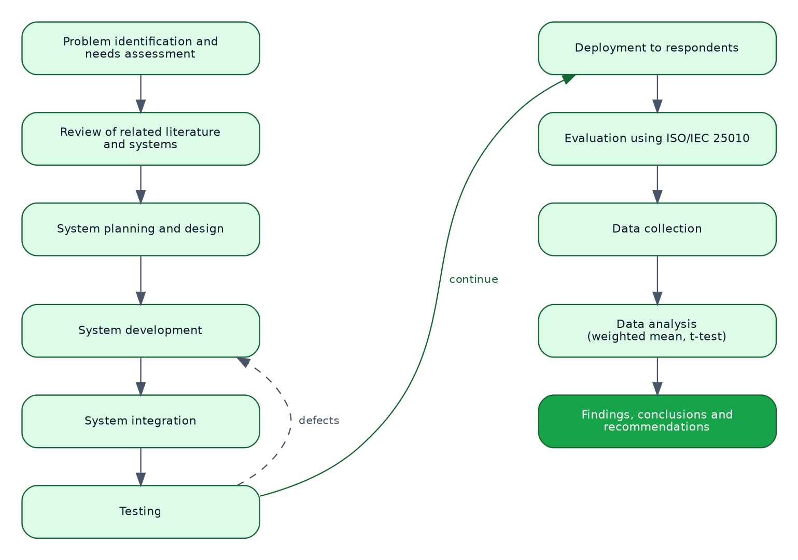{width=6.0in}

## 1.8 Research Environment

The study was conducted at Talibon Polytechnic College, located in San Isidro, Talibon, Bohol, Philippines. The college serves as a centre for technical and vocational education in Talibon, with a population of students, faculty, and staff who rely on tricycle transportation for their daily commute to and from the campus.

The research environment specifically covered the immediate vicinity of the college, including the main campus entrance, nearby tricycle terminals, and the surrounding barangays from which most commuters originate. This setting was selected because of the high volume of daily tricycle transactions involving the college community and the clear need for a more organized and digital approach to transportation within the institution.

The fare schedule used by the system was obtained from the Federation of Tricycle Operators and Drivers Association of Talibon, whose published rates cover twelve zones across the municipality: Balintawak, Santo Niño, San Francisco, San Agustin, the combined zone of Bagacay, Burgos and Rizal, Zamora, San Carlos, Tanghaligue, San Isidro, San Jose, San Pedro, and San Roque.

## 1.9 Research Participants and Respondents

The respondents of this study consisted of two groups.

**Students of Talibon Polytechnic College.** Students were selected because they represent the primary users of the passenger side of the system, being the main commuters who depend on tricycle transportation for daily travel to and from the campus. The method of determining the sample size for student respondents is to be set with the guidance of the study's statistician.

**Tricycle drivers serving the college community.** Drivers were included because they are the service providers whose operations the system aims to improve. **Total enumeration** was used for this group, given the limited number of drivers serving the campus.

*[Population figures, the sample size, and the number of respondents who took part are to be recorded here following data collection.]*

## 1.10 Research Instruments

The primary data instrument used in this study is a structured researcher-made questionnaire, prepared in two versions: one for tricycle drivers and one for passenger-respondents.

Each version gathers information on the existing problems in the current tricycle transportation arrangement and evaluates the developed system. The evaluation portion was adapted from the **ISO/IEC 25010 software quality model** (International Organization for Standardization, 2011) and covers four characteristics: usability, functionality, efficiency, and reliability. Each characteristic is measured by five statements, and each statement is rated on a five-point Likert scale ranging from 5 (Strongly Agree) to 1 (Strongly Disagree). Each version closes with four open-ended questions inviting comment on the feature the respondent valued most, the problems observed, the improvements recommended, and any further remarks.

The questionnaire was reviewed and validated by the research adviser and by subject matter experts before distribution to ensure content validity and clarity. A pilot test was conducted with a small group of respondents to refine the instrument prior to the actual data collection. The complete instrument appears as Appendix C.

## 1.11 Data Gathering Procedure

The study followed a systematic procedure to ensure the proper development, implementation, and evaluation of the system.

**Securing Permission.** A letter of request was submitted to the Office of the College President of Talibon Polytechnic College and to the officers of the Federation of Tricycle Operators and Drivers Association of Talibon, seeking permission to conduct the study, to administer the needs assessment and evaluation, and to reproduce the published fare schedule within the application. The letters appear as Appendix B.

**Needs Assessment.** A structured needs assessment was administered to students and tricycle drivers to document the problems in the current arrangement. The responses established the functional requirements set out in Section 4.1.

**System Planning and Design.** The researchers identified the tools and components required for development, comprising Android Studio, Kotlin, Jetpack Compose, and Firebase Authentication, Realtime Database, and Cloud Messaging. A system architecture diagram and interface wireframes were prepared to guide development.

**System Development.** The passenger, driver, and administrator interfaces were built in Kotlin and Jetpack Compose according to the approved design. The system was configured to accept ride requests, price them from the FeTODAT schedule, match passengers with available drivers, and process driver registration and verification.

**System Integration.** All components were integrated and tested as a complete system. This included verifying communication between the application and Firebase Authentication for sign-in, the Realtime Database for live data and profile photographs, and Cloud Messaging for notifications. Defects found were corrected through debugging and adjustment.

**Testing.** The system underwent unit, integration, system, user acceptance, performance, and security testing using both simulated and live ride requests. The researchers recorded the system's ability to match passengers with drivers correctly, to price rides according to the posted schedule, to process bookings, and to deliver notifications.

**Deployment and Evaluation.** The application was distributed to selected respondents, who used it under real conditions and then completed the evaluation questionnaire.

**Data Collection.** Completed questionnaires and recorded test results were collected, organized, and prepared for analysis.

**Data Analysis.** The statistical treatment to be applied to the collected data is to be determined with the guidance of the study's statistician, and the results will form the basis of the conclusions and recommendations in Chapter 5.

**Ethical Considerations.** Participation was voluntary, and respondents were informed of the purpose of the study before taking part. Within the application itself, users are required to read and accept the Terms and Conditions, the Privacy Policy, and the Safety and Community Guidelines before the service becomes available to them, and drivers additionally accept the Driver Agreement; the acceptance is recorded against the account. Names were optional on the instrument. Personal data collected by the application itself, comprising name, email address, mobile number, date of birth, and an optional photograph, are held in the project's Firebase instance, are used only to operate the service, and are described to the user in the privacy notice available inside the application. No payment or financial information is collected by the system at any point.

## 1.12 Definition of Terms

**Administrator.** The user responsible for verifying drivers, maintaining the fare table, reviewing concerns, monitoring activity, and exporting reports. Also referred to as the system administrator.

**Booking Request.** A request made by a passenger through the system for a ride to a chosen destination, carrying the pickup point, the destination, the number of passengers, the luggage declared, and the priced fare.

**Discounted Rate.** The fare column of the FeTODAT schedule applicable to senior citizens, persons with disabilities, and students, set below the regular rate for the same destination.

**Driver Availability.** The status indicating whether a driver is currently accepting ride requests, controlled by the driver through an online and offline toggle.

**Driver Onboarding.** The process of registering, submitting credentials, and being verified by an administrator before a driver is allowed to accept passengers through the system.

**FeTODAT.** The Federation of Tricycle Operators and Drivers Association of Talibon, the body whose published schedule fixes tricycle fares within the municipality.

**Fare Stop.** A single priced destination in the fare table, belonging to a zone and carrying both a regular rate and a discounted rate.

**Fare Table.** The complete set of fare stops held in the system's database, seeded from the published FeTODAT schedule and maintained thereafter by the administrator.

**Jetpack Compose.** The declarative user interface toolkit for Android in which the application's screens are written.

**Minimum Fare.** The lowest amount that may be charged for any ride, set separately for the regular and discounted rate columns by the governing ordinance.

**Mobile Application.** A software application designed to run on smartphones, used in this study for booking rides and managing transportation services.

**Notification.** An alert generated by the system informing a user of an event that concerns them, such as a ride being accepted, a ride status changing, a driver's verification being decided, or a concern being resolved.

**Passenger.** A user who requests and uses transportation services through the system.

**Real-Time Processing.** The ability of the system to reflect a change in data on every connected device as the change occurs, without the user refreshing.

**Regular Rate.** The fare column of the FeTODAT schedule applicable to passengers who do not qualify for the discounted rate.

**Ride Matching.** The process of pairing a passenger with an available driver. In this system, a request is broadcast to all available drivers and matched to the first driver who accepts it.

**Ride Scheduling System.** A digital system that allows passengers to request rides and matches them with available drivers.

**Route.** The path taken by the driver from the passenger's pickup location to the destination.

**Smart Transportation System.** A technology-based system that uses digital tools and real-time data to improve the efficiency and management of transportation services.

**Transportation Efficiency.** The ability of the system to provide faster, more organized, and more reliable transportation with minimal delay.

**Tricycle Driver.** A registered individual who operates a motorized tricycle and provides transportation services to passengers within and around Talibon Polytechnic College.

**User Interface (UI).** The visual part of the system through which users interact with the application.

**Verification Status.** The state of a driver's application to operate within the system, being one of pending, approved, rejected, or expired.

**Zone.** A grouping of destinations in the FeTODAT schedule, corresponding to a barangay or a cluster of barangays within the municipality.

[[PB]]
# Chapter 2 {-}

# REVIEW OF RELATED LITERATURE AND SYSTEMS

## 2.1 Related Literature

Transportation has always adapted to the tools available to it, and the rise of digital technology has pushed that adaptation further and faster than before. Communities around the world are turning to smart transportation systems not only to move people more efficiently but to improve the whole experience of getting from one place to another. These systems bring together mobile applications, real-time data, and coordinating platforms to give passengers and service providers a shared, responsive environment (Wang et al., 2022).

Ride-hailing platforms are the most visible example of this shift. Instead of standing on the street hoping for a vehicle, a user taps a button and knows when a driver will arrive. Zhang et al. (2021) noted that these applications have made it considerably easier to find transportation by linking passengers directly with nearby available drivers, removing the uncertainty and wasted time that came with the older arrangement.

Ride scheduling adds structure to the matching process. Rather than simply connecting whoever is nearby, a scheduling system factors in timing, preference, and real-time availability to produce more reliable matches. Cheng et al. (2024) found that this approach measurably reduces how long passengers wait and helps ensure vehicles are used productively through the day.

Driver management is a part of the problem that receives less attention. A transportation platform is only as trustworthy as the people providing the service. Dastani et al. (2024) pointed out that a system for registering, verifying, and monitoring drivers does more than keep records: it improves the reliability of the service and gives passengers confidence in who is picking them up.

Smart transportation is not exclusive to large cities. Kumar and Singh (2023) showed that digital transportation platforms work in smaller local settings, and that the impact there can be greater, because those communities have fewer alternatives. Where a simple digital tool replaces an unstructured arrangement, the improvement in daily life is substantial.

A dimension less often examined in this literature is **fare transparency**. In many Philippine municipalities, tricycle fares are fixed by local ordinance and posted physically at terminals. The rate is therefore public in principle but not available at the moment a passenger decides to travel. Placing that published schedule inside the booking interface converts a rule that exists on paper into information the passenger holds before agreeing to the ride, which is a distinct contribution separate from matching efficiency.

## 2.2 Related Studies

A number of studies have examined how ride scheduling and digital transportation platforms can be improved, each contributing a different angle.

Cheng et al. (2024) addressed fairness in ride scheduling by designing a system that accounts for user preferences when pairing passengers with drivers. Their finding that efficiency and user satisfaction need not be in conflict is directly relevant: when a system reflects what users actually want, they are more likely to use it and to trust it.

Rapp et al. (2023) approached the problem from a last-mile perspective, developing an on-demand ride-sharing system for autonomous buses. Their work demonstrated that dynamic, real-time scheduling, in which the system adjusts to incoming requests rather than following fixed routes, meaningfully reduces waiting time while maintaining service performance.

Huang et al. (2024) examined vehicle routing and how better route planning affects broader transportation outcomes. Their study found that modest gains in route efficiency translated into significantly lower operating costs and faster service, a reminder that the logistics behind a transportation system matter as much as its user-facing features.

Narayanan and Antoniou (2021) conducted a systematic review of ride-sharing platforms to understand what drives adoption and what discourages it. Their findings identified convenience, reliability, and ease of use as the three factors that most shape whether a platform succeeds. These are not complicated expectations, and they map closely onto the usability, efficiency, and reliability characteristics used to evaluate the present system.

Li et al. (2024) focused on the first- and last-mile problem in ridesharing, the segments of a journey that tend to be least well served. By optimizing how vehicles of different types are deployed across those segments, their study showed that scheduling efficiency and service quality can be improved together rather than traded against each other.

Taken together, these studies establish that system-managed matching outperforms chance-based matching, that user preference and fairness affect adoption, and that the benefits are not confined to large fleets or large cities. What they do not address is the specific case of a fare regime fixed by local ordinance and enforced socially rather than algorithmically, which is the condition under which tricycle service in Talibon operates.

## 2.3 Comparison of Related Systems

Table 1 compares the developed system with commercial ride-hailing platforms operating in the Philippines and with the current unstructured arrangement it is intended to replace.

: Table 1. Comparison of Related Systems

| System | Features | Strengths | Weaknesses |
|:---|:---|:---|:---|
| **Grab** (Grab Holdings) | Multi-service ride-hailing covering cars, delivery, and payments; live GPS tracking; cashless and cash payment; in-app rating; dynamic pricing | Mature and heavily tested; large driver supply in served cities; integrated wallet; strong support infrastructure | Does not serve tricycles; not available in Talibon; dynamic pricing is incompatible with an ordinance-fixed fare regime; commission model reduces driver earnings |
| **Angkas** | Motorcycle taxi booking; fixed distance-based fare; driver accreditation and training; helmet provision | Formalized an informal transport mode; strong driver screening; fare shown before booking | Motorcycle taxis only; operates in designated metropolitan areas and not in Talibon; central operator model unsuitable for a municipal drivers' association |
| **JoyRide** | Motorcycle taxi and delivery; in-app booking; fixed fare display | Fare visible before booking; covers several Philippine cities | Motorcycle taxis only; not available in Talibon; no tricycle support |
| **Current arrangement in Talibon** (terminal queue and roadside hailing) | Physical queueing; verbal fare agreement; fare schedule posted at terminals | No technology or literacy barrier; no data cost; works during power or network outages | Unpredictable waiting time; drivers idle or roaming; posted fare not available at the point of decision; no driver verification; no record of trips or complaints |
| **TrikRide** (developed system) | Tricycle ride booking; destination selected from the official FeTODAT schedule; fare shown before booking with separate regular and discounted rates; administrator-controlled driver verification; live ride status; concern reporting; administrative monitoring and report export | Prices from the governing ordinance rather than a formula; discounted rate for seniors, persons with disabilities, and students is built in; verification gate before a driver can operate; fare table editable by the administrator without a software release; reports exportable for any month, year, or range of dates | Requires an Android device and an internet connection; no turn-by-turn navigation; no online payment; coverage limited to Talibon; adoption depends on the drivers' association |

Three observations follow from the comparison. First, no existing platform serves tricycles in Talibon, so the developed system does not displace an incumbent; it addresses a gap. Second, every commercial platform computes fares from distance and demand, which is the wrong model where a municipal ordinance fixes the price per destination. Third, none of the commercial platforms implements the statutory discount for senior citizens, persons with disabilities, and students, because none operates under a fare regime that mandates one.

## 2.4 Theoretical Framework

This study is grounded in three theories that together explain whether a system of this kind will be adopted, whether it will fit the work it is meant to support, and how its success should be judged.

### Technology Acceptance Model

The Technology Acceptance Model (Davis, 1989) holds that a user's intention to use a technology is determined chiefly by two beliefs: **perceived usefulness**, the degree to which the person believes the system will improve their performance, and **perceived ease of use**, the degree to which they believe using it will be free of effort.

The model applies directly here. A driver will adopt the system if it brings more paid trips than roaming does, which is perceived usefulness, and if operating it requires no more than a toggle and a button, which is perceived ease of use. A passenger will adopt it if it produces a ride faster than walking to a terminal, and if booking takes fewer taps than the alternative takes minutes. The design decisions in this study follow from that: the driver interface reduces the core task to a single online toggle and an accept button with a visible countdown, and the passenger's booking path is a linear sequence with the fare shown before commitment.

The usability and efficiency characteristics of the evaluation instrument correspond to perceived ease of use and perceived usefulness respectively.

### Task-Technology Fit

Task-Technology Fit (Goodhue & Thompson, 1995) holds that a technology improves performance only when its capabilities match the demands of the task. A well-built system applied to a task it does not fit produces no benefit.

The task in this study has a specific shape. Fares are fixed per destination by ordinance, not computed from distance. Trips are short and local. Drivers work from a small set of known terminals. Passengers travel to a known set of destinations. A technology that fits this task must therefore price from a lookup table rather than a formula, must offer destinations from a defined list rather than an open map search, and must work on inexpensive Android devices over an intermittent mobile connection.

This theory accounts for the central design decision of the study, which is that the fare engine performs a lookup against the published schedule rather than a distance calculation. A distance-based fare engine would be a poorer fit for the task even though it is the more common design. The fit extends beyond the calculation itself: because the schedule the system prices from is the one the association already publishes and posts, the system introduces no pricing scheme that a driver or a passenger has to learn or accept.

### Information Systems Success Model

The DeLone and McLean Information Systems Success Model (DeLone & McLean, 2003) holds that the success of an information system is a function of system quality, information quality, and service quality, which shape use and user satisfaction, which in turn produce net benefits.

In this study, system quality is measured by the reliability and efficiency characteristics of the evaluation instrument. Information quality is addressed by the accuracy of the fare table, which is why rows transcribed with any uncertainty are flagged for verification and rows without a usable rate are disabled rather than left to price a ride with a wrong number. Net benefits correspond to the reduction in passenger waiting time and the improvement in driver utilization named in objective four.

## 2.5 Conceptual Framework

The conceptual framework of this study follows the Input-Process-Output model. It shows how the data entering the system are transformed into outcomes that address the problems identified in Section 1.1.

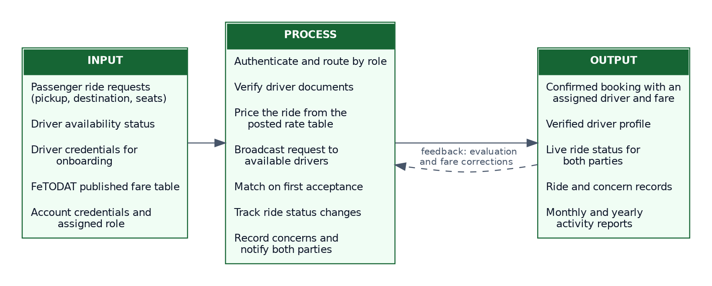{width=6.0in}

**Input.** The input stage comprises the data required for the system to operate: passenger ride requests carrying a pickup point, a destination, a passenger count, and any luggage; driver availability status submitted through the driver interface; driver registration credentials submitted during onboarding; the published FeTODAT fare schedule; and the account credentials and assigned role used for authentication.

**Process.** The process stage is the operation of the system. The system authenticates the user and routes them to the interface for their role. It verifies a driver's submitted credentials against the registration criteria before granting the ability to accept rides. It prices a requested ride by looking up the destination in the fare table, selecting the rate column that applies to the passenger, applying the ordinance minimum where the posted rate falls below it, and multiplying by the number of passengers. It broadcasts the request to every available driver and matches the passenger with the first to accept. It tracks the ride through its status changes and notifies both parties at each one. It records concerns raised by either party and routes them to the administrator.

**Output.** The output stage is the result: a confirmed booking with an assigned driver, an agreed fare, and live status visible to both parties; a verified driver profile, approved or rejected; a stored record of every ride and every concern; and monthly, yearly, and cumulative reports of activity. The intended outcomes are reduced passenger waiting time, improved driver utilization, fare transparency at the point of decision, and a more accountable tricycle transportation service for the Talibon Polytechnic College community.

**Feedback.** The framework includes a feedback path. Evaluation results and fare corrections identified in use return to the process stage, where the administrator amends the fare table and the researchers address defects. This reflects the maintenance phase of the development model.

## 2.6 Synthesis

The literature and studies reviewed converge on several points that shaped this study.

Digital matching outperforms chance-based matching. Zhang et al. (2021), Cheng et al. (2024), and Li et al. (2024) each report reduced waiting time and better vehicle utilization when a system rather than physical proximity determines who serves whom. This supports objectives one, three, and four of the present study.

Driver management is not administrative overhead but a determinant of service quality. Dastani et al. (2024) connected registration and verification directly to reliability and passenger confidence, which supports objective two and the verification gate implemented in this system.

Scale is not a precondition. Kumar and Singh (2023) found the benefits of digital transportation platforms present, and in some respects amplified, in smaller local settings. This supports the choice of a single municipality as the study environment.

Adoption depends on convenience, reliability, and ease of use. Narayanan and Antoniou (2021) identified these as the decisive factors, and they align with the Technology Acceptance Model and with three of the four characteristics in the evaluation instrument.

Two gaps in the reviewed work motivated the specific contribution of this study.

The first is the **fare model**. Every system reviewed prices rides by distance, by time, or by demand. None addresses a setting where a local ordinance fixes the fare for each destination and mandates a discount for particular passengers. Pricing by lookup against a published schedule, with a statutory minimum and a discounted column, is a requirement produced by the study environment rather than borrowed from the literature.

The second is **transparency as an outcome in its own right**. The reviewed literature treats fare display as a convenience feature. Where fares are fixed by ordinance but posted only at terminals, placing the schedule in the passenger's hand at the moment of decision is a substantive change in the relationship between the two parties, not a convenience.

This study therefore adopts the matching and onboarding approaches established in the literature and adds a fare mechanism appropriate to a municipality where prices are set by ordinance rather than by the market.

[[PB]]

# Chapter 3 {-}

# TECHNICAL BACKGROUND

This chapter documents the technical foundation of the developed system: what is required to build it, what is required to run it, and how its parts are arranged.

## 3.1 Software Requirements

### Development Environment

| Component | Specification |
|:---|:---|
| Integrated Development Environment | Android Studio Ladybug (2024.2.1) or later |
| Java Development Kit | JDK 17 (bundled with Android Studio) |
| Android Gradle Plugin | 8.7.3 |
| Gradle | 8.11.1, pinned by the project wrapper |
| Kotlin | 2.1.0 |
| Compile SDK | Android API level 35 |
| Target SDK | Android API level 34 |
| Minimum SDK | Android API level 24 (Android 7.0 Nougat) |
| Version control | Git, with the repository hosted on GitHub |
| Operating system | Windows 10 or later, macOS 12 or later, or a current Linux distribution |

The minimum SDK of API level 24 was chosen deliberately. Android 7.0 was released in 2016, and devices running it or later account for the overwhelming majority of Android devices still in use. Setting the floor lower would have required abandoning several libraries used by the project; setting it higher would have excluded drivers using older handsets, which is precisely the group the system needs to reach.

### Runtime Environment for End Users

| Component | Requirement |
|:---|:---|
| Operating system | Android 7.0 (API level 24) or later |
| Connectivity | Mobile data or Wi-Fi; the application does not operate offline |
| Optional | A Google Maps API key. Without one the system renders OpenStreetMap instead; no function is lost |
| Storage | Approximately 30 MB for installation |
| Permissions | Internet; camera, for capturing a profile photograph; notification posting on Android 13 and later. Choosing an existing photograph requires no permission, and neither does saving an exported report. |
| Account | A valid email address for registration |

### Third-Party Libraries and Services

| Library or service | Version | Purpose |
|:---|:---|:---|
| Jetpack Compose BOM | 2024.12.01 | Declarative user interface toolkit |
| Material 3 | via Compose BOM | Design system components and theming |
| Firebase BOM | current stable | Version alignment across Firebase libraries |
| Firebase Authentication | via Firebase BOM | Email and password sign-in and session management |
| Firebase Realtime Database | via Firebase BOM | Live data storage and synchronization |
| Firebase Cloud Messaging | via Firebase BOM | Notification delivery |
| Google Play Services Maps | 18.2.0 | Google Maps rendering, used when a key is configured |
| osmdroid | 6.1.20 | OpenStreetMap rendering, used when no key is configured |
| Google Play Services Location | 21.3.0 | Device position from the fused location provider |
| Kotlin Coroutines | bundled with Kotlin 2.1.0 | Asynchronous work and reactive data streams |
| AndroidX Lifecycle ViewModel Compose | current stable | ViewModel integration with Compose |
| AndroidX Activity Compose | current stable | Activity result contracts for camera, gallery, and file creation |

## 3.2 Hardware Requirements

### Development Workstation

| Component | Minimum | Recommended |
|:---|:---|:---|
| Processor | Dual-core x86-64, 2.0 GHz | Quad-core x86-64 or Apple Silicon |
| Memory | 8 GB RAM | 16 GB RAM |
| Storage | 20 GB free | 50 GB free, solid-state |
| Display | 1280 × 800 | 1920 × 1080 or higher |
| Network | Broadband, for dependency resolution and Firebase access | Broadband |

The recommended memory figure is not decorative. Android Studio with the Gradle daemon and an emulator running will use most of 16 GB, and a build machine with 8 GB will complete builds but slowly.

### Target Device

| Component | Minimum | Recommended |
|:---|:---|:---|
| Operating system | Android 7.0 (API 24) | Android 11 or later |
| Processor | Quad-core, 1.4 GHz | Octa-core |
| Memory | 2 GB RAM | 3 GB RAM or more |
| Storage available | 100 MB | 250 MB |
| Display | 4.7 inches, 720 × 1280 | 6.0 inches, 1080 × 2340 |
| Camera | Rear camera, for profile photograph capture | Any |
| Connectivity | 3G mobile data | 4G LTE or Wi-Fi |

### Server-Side Hardware

The system requires no server hardware procured or maintained by the college. All backend functions are provided by Google Firebase, a managed backend-as-a-service platform. This is a deliberate architectural choice: a capstone project deployed to a municipal drivers' association cannot depend on a physical server that someone must house, power, secure, and administer after the researchers graduate.

## 3.3 Programming Languages

**Kotlin 2.1.0** is the language in which the entire application is written. Kotlin is the language Google designates as preferred for Android development. Three of its properties mattered to this project. Its type system distinguishes nullable from non-nullable references at compile time, which eliminates an entire category of runtime crash. Its coroutine support makes asynchronous work, of which a networked application has a great deal, readable as sequential code. Its data classes generate equality, copying, and destructuring automatically, which suits the model layer of this system where a data class per entity is the whole of the definition.

**Kotlin DSL for Gradle** is used for the build configuration, in place of the older Groovy syntax, giving the build scripts the same type checking and editor support as the application code.

**XML** is used for Android resources that are not expressible in Compose: the application manifest, string and colour resources, launcher icon definitions, the file provider path configuration, and the backup and data extraction rules.

**Firebase Security Rules**, a JSON-based declarative language, is used to express server-side authorization for the Realtime Database.

## 3.4 Development Tools

**Android Studio** is the official integrated development environment for Android, and provided code editing, the Compose preview and layout inspector, the device emulator, the debugger, and Logcat for runtime diagnostics.

**Gradle 8.11.1 with Android Gradle Plugin 8.7.3** manages dependency resolution, compilation, resource processing, and packaging. The Gradle wrapper is committed to the repository so that every machine building the project uses the same Gradle version, which removes a class of build failure caused by version drift between developers.

**Git and GitHub** provide version control and a remote repository. Development proceeded on a feature branch, with the history serving both as a safety net and as a record of the development sequence.

**Figma** was used to prepare interface wireframes and the visual design before implementation, so that layout decisions were settled before code was written.

**Firebase Console** provides the web administration interface for the backend: creating the database, defining security rules, inspecting stored data, managing authentication, and reviewing usage.

**Graphviz and Matplotlib** were used to generate the system diagrams presented in Chapter 4 from textual descriptions, so that a change to a diagram is a change to a text file rather than a manual redraw.

## 3.5 Database Technologies

### Firebase Realtime Database

The system stores its data in **Firebase Realtime Database**, a cloud-hosted NoSQL database that holds all data as a single JSON tree and synchronizes changes to every connected client as they occur.

The Realtime Database was selected over a relational database and over Cloud Firestore for reasons specific to this application.

**Live synchronization is the core requirement.** A ride-hailing application is a system in which two parties must see the same state at the same time. When a driver accepts a request, the passenger's screen must change without the passenger doing anything. The Realtime Database delivers this through persistent listeners rather than polling, which is the natural fit for the problem.

**Latency matters more than query power.** The Realtime Database offers lower latency than Cloud Firestore for small, frequent updates, which is the access pattern of ride status changes. The queries this system performs are simple lookups and filters by a single field; it does not need the compound query support that would favour Firestore.

**Cost at the scale of this study is zero, and no payment method is required.** The Realtime Database free tier provides 1 GB of storage, 10 GB of monthly transfer, and 100 simultaneous connections, which is well beyond what a municipal pilot will consume. This is not merely an economy: a capstone project handed over to a college department and a drivers' association cannot depend on a recurring bill that somebody must agree to pay.

**Offline caching is built in.** The client library caches recent data and re-synchronizes when the connection returns, which mitigates the intermittent connectivity common in the study area.

The trade-off accepted is that a JSON tree provides no schema enforcement and no joins. This is mitigated by defining every entity as a Kotlin data class with default values for every field, so that the application layer imposes the structure the database does not, and by denormalizing the few relationships the system needs.

### Firebase Authentication

Account creation, sign-in, session persistence, and password reset are handled by **Firebase Authentication** using the email and password provider. No password is ever stored or transmitted by the application itself; credentials are exchanged directly between the Firebase client library and Google's authentication service, and the application receives only an opaque user identifier and a session token.

### Profile Photographs Without Object Storage

Firebase Cloud Storage would ordinarily hold an uploaded image, but Firebase requires the paid Blaze plan before a Storage bucket can be provisioned on a new project, and Blaze requires a payment method on file. Because a condition of this study is that the deployed system incur no cost and require no such commitment from the college, Cloud Storage is not used.

Profile photographs are instead reduced and stored in the Realtime Database. When a user selects an image, the application decodes it at a reduced sample size, crops it to a square, scales it to 256 pixels, and compresses it as a JPEG, stepping down through decreasing quality levels until the base64-encoded result fits within 24 kilobytes. An avatar displayed at 96 density-independent pixels needs no more resolution than this.

The encoded photograph is written to a `profilePhotos` node keyed by user identifier, rather than into the user record itself. This separation matters in practice: the administrative screens read every user record continuously to populate their lists, and an image embedded in each record would be transferred on every one of those reads. Held separately, a photograph is transferred only when it is actually displayed.

At 24 kilobytes per photograph, one thousand users would consume roughly 24 megabytes of the 1 gigabyte free allowance.

The same technique carries the one document the system does collect: a photograph of the driver's licence. Its budget is different, because its purpose is different. An avatar has only to resemble the person at 96 density-independent pixels; a licence must be legible enough for an administrator to read the number, the name, and the expiry date and compare them with what the driver typed. The long edge is therefore scaled to 1280 pixels rather than 256, the aspect ratio is preserved rather than cropped square — cropping would cut the ends of the licence number — and the budget rises to approximately 200 kilobytes. Thirty registered drivers consume around six megabytes, which is immaterial against the free allowance.

Licence photographs are written to a `driverDocuments` node rather than to the driver record, for the reason given above and for a second one addressed in Section 3.8: they are the only data in the system that are not readable by every authenticated account.

### Data Organization

The database is organized as nine top-level nodes, documented in Table 8 and Figure 11.

## 3.6 Network Architecture

The system uses a **client to cloud** architecture. There is no intermediate application server: the Android client communicates directly with Google Firebase services over the public internet.

Communication uses two channels. Authentication and one-off database reads and writes travel over **HTTPS**, secured by TLS 1.2 or later. Live database synchronization travels over a **persistent WebSocket connection** that the Firebase client library opens and maintains, over which the server pushes changes as they occur.

This arrangement has three consequences worth stating. It removes the need for the college to operate a server. It means that authorization must be enforced by Firebase Security Rules on the server side, because there is no application server in the path to enforce it. And it means the application is unusable without connectivity, which is recorded as a limitation in Section 1.5.

Firebase's endpoints are reached through Google's global content delivery infrastructure, so latency from Talibon is determined by the nearest edge location rather than by the distance to a single origin server.

## 3.7 Software Architecture

The application follows the **Model-View-ViewModel (MVVM)** pattern with an additional repository layer, which is the architecture Google recommends for Android applications.

**Model.** Kotlin data classes representing the entities the system handles: `User`, `Driver`, `Ride`, `RideRequest`, `FareStop`, `FareConfig`, `Complaint`, and `AppNotification`. Every field carries a default value, which is what allows Firebase to deserialize a partial record without failing.

**View.** Composable functions written in Jetpack Compose. Views hold no business logic. They render the state given to them and report user events upward. Because Compose is declarative, a change in state causes the affected part of the interface to be recomposed automatically, which removes the manual view-updating code that a traditional Android view hierarchy requires.

**ViewModel.** One ViewModel per role and concern: `AuthViewModel`, `PassengerViewModel`, `DriverViewModel`, `AdminViewModel`, `ProfileViewModel`, and `SupportViewModel`. Each exposes state as a `StateFlow` and accepts events as method calls. ViewModels survive configuration changes such as screen rotation, so state is not lost when a device is turned.

**Repository.** `AuthRepository`, `RideRepository`, `DriverRepository`, `AdminRepository`, `FareRepository`, and `SupportRepository` mediate between ViewModels and the data source. They expose suspending functions for one-off operations and `Flow` streams for live data. Because ViewModels depend on repositories rather than on Firebase directly, the data source could be replaced without touching any ViewModel.

**Service.** `FirebaseService` is the single point at which the application touches the Firebase Realtime Database. Live listeners are wrapped in `callbackFlow`, which converts Firebase's listener callbacks into Kotlin `Flow` streams and, importantly, removes the listener when the collecting coroutine is cancelled. This prevents the memory leaks that unbalanced listener registration causes.

**Domain logic.** Three objects hold logic that belongs to no single screen: `FareEngine`, which prices a ride from the fare table; `ReportBuilder`, which aggregates the figures the reports are built from; and `PasswordRules`, which evaluates password strength. `PdfReportWriter` and `PdfChart` turn those aggregates into the printable document.

Data flows in one direction. A user event goes from View to ViewModel to Repository to Service to Firebase. A data change comes back from Firebase through a Flow, through the Repository, into the ViewModel's state, and causes the View to recompose. This unidirectional flow makes the state of the interface a function of the data, which makes behaviour predictable and defects easier to locate.

## 3.8 Security Features

**Authentication.** Access requires an account authenticated by Firebase Authentication. Passwords are never handled by the application; they are transmitted directly to Google's authentication service over TLS and stored there as salted hashes. The application holds only a session token and an opaque user identifier.

**Password policy.** Registration enforces a policy stronger than the Firebase minimum. A password must be at least eight characters and must contain an uppercase letter, a lowercase letter, and a digit. The registration screen shows each rule and marks it as satisfied as the user types, so that a rejected password is a rare event rather than the normal experience of registering.

**Role-based access control.** Every account carries a `userType` of passenger, driver, or administrator, which determines which interface is presented after sign-in. A driver additionally carries a `verificationStatus`, and a driver whose status is not approved cannot accept ride requests regardless of what the interface offers.

**Server-side authorization.** Because the client speaks to Firebase directly, authorization is enforced by Firebase Security Rules evaluated on the server. The rules restrict a user to reading and writing their own profile, restrict driver verification status to administrators, and make the fare table readable by all authenticated users but writable only by administrators. Client-side checks are treated as user interface convenience, not as security.

Three of the rules deserve description, because their form follows from a constraint the platform imposes.

*Privilege cannot be granted to oneself.* A user may write their own record, and the field determining their role sits on it, so a validation clause restricts what that field may be set to: an account may declare itself a passenger or a driver and nothing else. Five separate rules grant administrative powers on the strength of that field, and without the clause any account could award itself all of them. Administrator accounts are created by editing the field in the Firebase console, which is not subject to the rules.

*Ride and concern records are scoped by requiring a query rather than by filtering.* A rule cannot return part of a collection: the platform either grants the node or refuses it. The rule therefore requires that the client asked a question already limited to itself — ordering by the passenger or driver identifier and matching its own — and refuses any broader request. The application issues exactly those queries, with the corresponding index declarations. An administrator is exempt and reads the collections whole, which is what the monitoring screen and the exported reports require.

*A ride is writable only by the driver carrying it.* Creating one requires that the new record name the caller as its driver, which is what acceptance does; thereafter only that driver may advance its status. Passengers do not write to ride records at all.

**Encryption in transit.** All communication uses TLS 1.2 or later. No data travels in plain text.

**Secrets management.** API keys and other confidential configuration are held in a `.env` file that is excluded from version control by `.gitignore`. The build reads that file and injects the values as manifest placeholders and build configuration fields. A committed `.env.example` documents which keys are required without disclosing their values. The Firebase configuration file `google-services.json` is likewise excluded from version control.

**No financial data.** The system collects no card numbers, no bank details, and no payment credentials of any kind. Fares are settled in cash between passenger and driver. This removes the entire category of risk associated with payment data.

**Data minimization.** The system collects name, email address, mobile number, date of birth, and an optional photograph for all users, plus licence and tricycle details for drivers. It collects nothing beyond what the service requires to operate.

**Sensitive personal information.** One item the system holds falls into a stricter category than the rest. Section 3(l) of the Data Privacy Act of 2012 (Republic Act No. 10173) classifies government-issued identifiers, and licences specifically, as *sensitive personal information*. The photograph a driver submits for verification is therefore treated differently from everything else the system stores, in four respects.

*Access.* The `driverDocuments` node is the only node in the database not readable by every authenticated account. Its security rule admits the driver it belongs to and administrators, and no one else. Passengers cannot reach it, it is never attached to a ride, and it appears in no exported report. An administrator's interface keeps each photograph collapsed until it is deliberately opened, so that a verification queue does not display a column of identity documents to whoever is standing nearby.

*Consent.* Agreement is obtained at the moment of upload rather than inferred from the Terms accepted at registration, and the dialogue that obtains it states in plain terms what the image is for, who can open it, and when it is destroyed. The moment of agreement is recorded with the document. A general consent given days earlier to a document few people read is not, in the view taken here, a meaningful basis for holding someone's identity document.

*Retention.* The retention rule is enforced in code and not left to a written policy. Refusing an application deletes the photograph in the same operation that records the refusal, since a refused applicant's licence serves no purpose the system has. An approved driver's photograph is retained while the account is active, because it is required again when the licence expires and if a concern about a ride is later disputed, and it is deleted with the account. Withdrawing an approval already granted is implemented as a separate operation from refusing an application, and deliberately does not delete the photograph: approval is usually withdrawn because a licence has lapsed or because a concern is under examination, and in either case destroying the document would remove the evidence the decision may later have to be justified against. A driver may withdraw the photograph themselves at any time.

*Location.* The licence number and expiry are held with the photograph rather than on the driver record. That record is readable by every authenticated account, because a passenger needs the availability and position kept on it, and a licence number is among the government-issued identifiers the Act names. Holding all three together also means there is one node to protect and one to destroy. A consequence is that an administrator sees the number where they see the photograph, behind a deliberate action rather than on the face of the verification card, and that the exported driver report no longer carries it: that report is a record of performance, it leaves the device, and an identity number has no business travelling with it.

*Proportionality.* No other document is requested. The system does not collect insurance certificates, inspection certificates, or secondary identification, all of which an earlier draft of the data model anticipated. Verification of the right to drive requires the licence, and requiring more would collect personal information the service has no use for.

**Ratings without a trusted server.** A passenger must be able to rate the driver who carried them, and must not be able to edit that driver's record. With no application server between the client and the database, both halves have to be expressed as rules. Each rating is therefore written to `driverRatings/{driver}/{rater}` — keyed by the person giving it, which is the only shape a rule can restrict to that person — and validated to a value between one and five. The driver's own device reads those ratings, averages them, and writes the figure onto its own record, which the administrative screens and the exported reports then read.

The consequence, recorded here rather than hidden, is that a newly given rating reaches an administrator's view when the driver next opens the application rather than at the moment it is given. Removing that lag would require either a server-side function, which is outside the scope of this study for the same reason push notification delivery is, or permitting passengers to write to driver records, which would be a materially worse arrangement than a few hours of delay.

**A limit of verification.** The system confirms that a document was presented and that it corresponds to the details the driver entered. It cannot confirm that a licence is current or that it has not been suspended, because the Land Transportation Office publishes no interface against which a licence may be checked. The verification implemented here is documentary, and Section 1.5 records this.

**Session handling.** Sessions persist across application restarts, which is a convenience feature, but signing out clears the session immediately and returns the user to the sign-in screen. A session does not, however, survive the installation. The authentication library keeps it in the application's shared preferences, and Android's default backup behaviour copies those to the user's cloud storage and restores them on reinstallation, with the effect that a user who removed the application returned to it already signed in, and that a restore onto a replacement handset could carry the session with it. Backup and device-to-device transfer are therefore both disabled for this application. The two are configured separately because disabling cloud backup does not, on the devices of every manufacturer, disable transfer. No user data is lost by this: the only information held locally is a remembered email address and a flag recording that the introductory carousel has been seen.

**Recorded consent.** The Terms and Conditions, Privacy Policy, Safety and Community Guidelines, and Driver Agreement are carried inside the application and are readable at any time from the profile screen. No account reaches a dashboard until it has accepted the documents that apply to it, with each one ticked separately after being made available to read in full; the only alternative offered is to sign out. The version accepted and the moment of acceptance are stored on the account, so that consent can be evidenced rather than assumed, an account created before consent was tracked is asked at its next launch, and a revision to the documents asks every user again.

**Audit trail.** Every ride, every verification decision, and every concern is stored with timestamps, producing a record that can be examined after the fact and exported for review.

## 3.9 System Architecture

Figure 3 presents the architecture of the system as four layers: the presentation layer containing the three role-specific interfaces, the application layer containing the ViewModels and domain logic, the data layer containing the repositories and the Firebase service, and the backend layer containing the four Firebase services.

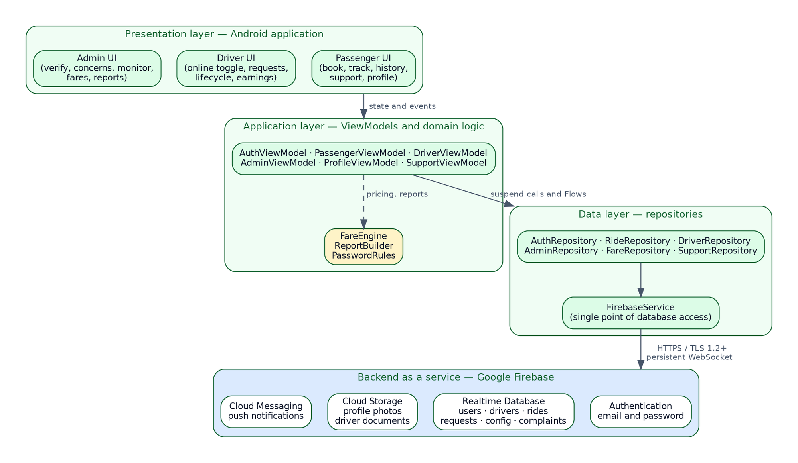{width=6.0in}

The arrangement is deliberately layered so that each layer depends only on the one below it. A screen knows about its ViewModel and nothing further. A ViewModel knows about repositories and not about Firebase. A repository knows about the Firebase service and not about the shape of the interface. This means a change to how data are stored affects one layer, and a change to how a screen looks affects one other, which is what makes a system of this size maintainable by a team of three.

[[PB]]
# Chapter 4 {-}

# METHODOLOGY, RESULTS, AND DISCUSSION

## 4.1 Requirements Analysis

Requirements were derived from three sources: the problems documented in the needs assessment, the objectives set out in Section 1.3, and the published FeTODAT fare schedule, which imposes requirements of its own on how fares must be computed.

### Functional Requirements

: Table 2. Functional Requirements

| ID | Requirement | Role | Objective served |
|:---|:---|:---|:---|
| FR-01 | The system shall allow a user to register with a full name, date of birth, email address, mobile number, and password. | All | 1, 2 |
| FR-02 | The system shall enforce a password of at least eight characters containing an uppercase letter, a lowercase letter, and a digit. | All | 2 |
| FR-03 | The system shall require the user to accept the Terms and Conditions, the Privacy Policy, and the Safety and Community Guidelines before an account is created. | All | 2 |
| FR-03a | The system shall prevent any signed-in account from reaching a dashboard until it has accepted the current version of the applicable documents, and shall record the version accepted and the time of acceptance against the account. | All | 2 |
| FR-03b | The system shall require a driver to accept the Driver Agreement before operating as a driver. | Driver | 2 |
| FR-04 | The system shall authenticate a user by email address and password. | All | 1, 2 |
| FR-05 | The system shall keep a user signed in across application restarts until they sign out. | All | 4 |
| FR-06 | The system shall allow a user to edit their profile and set a photograph from the camera or the gallery. | All | 6 |
| FR-07 | The system shall allow a user to request a password reset by email. | All | 2 |
| FR-08 | The system shall present a first-time user with an introductory carousel, shown once. | All | 6 |
| FR-08a | The system shall allow a driver to submit a photograph of their driver's licence, obtaining a specific consent to hold it at the moment of submission, and shall allow the driver to withdraw it. | Driver | 2 |
| FR-08b | The system shall present that photograph to an administrator during verification, restrict it to the driver and administrators, and delete it when an application is refused. | Administrator | 2 |
| FR-09 | The system shall allow a passenger to select a pickup point by searching the same table of stops used for destinations, or by pinning any point on the map. | Passenger | 1 |
| FR-10 | The system shall allow a passenger to select a destination by searching the fare table by stop name or zone. | Passenger | 1 |
| FR-10a | The system shall allow a passenger to indicate a destination on the map, and shall offer the posted stop nearest to that point, with its fare, as the destination to be booked. | Passenger | 1 |
| FR-11 | The system shall allow a passenger to select the regular or the discounted rate column. | Passenger | 1 |
| FR-12 | The system shall allow a passenger to specify between one and five passengers and to declare luggage. | Passenger | 1 |
| FR-13 | The system shall display the computed fare, itemized, before the passenger submits the request. | Passenger | 1 |
| FR-14 | The system shall price a ride from the posted rate for the selected destination and rate column, applying the ordinance minimum where the posted rate falls below it, and multiplying by the number of passengers where fares are charged per head. | Passenger | 1 |
| FR-15 | The system shall broadcast a submitted ride request to all available, verified drivers. | Passenger, Driver | 3 |
| FR-16 | The system shall expire an unaccepted ride request after five minutes. | System | 3 |
| FR-17 | The system shall match a request to the first driver who accepts it and withdraw it from all others. | System | 3, 4 |
| FR-18 | The system shall show the passenger the ride status as it changes, from acceptance through to completion. | Passenger | 5 |
| FR-19 | The system shall allow a passenger to rate a completed ride. | Passenger | 6 |
| FR-20 | The system shall show a passenger their history of completed rides. | Passenger | 5 |
| FR-21 | The system shall allow a driver to submit a licence number, licence expiry date, and tricycle number. | Driver | 2 |
| FR-22 | The system shall prevent a driver whose verification status is not approved from accepting ride requests. | Driver | 2 |
| FR-23 | The system shall allow a driver to toggle their availability between online and offline. | Driver | 3 |
| FR-24 | The system shall show a driver the open requests with a visible countdown to expiry. | Driver | 3 |
| FR-25 | The system shall allow a driver to advance a ride through arriving, arrived, in progress, and completed. | Driver | 5 |
| FR-26 | The system shall show a driver their completed rides and total earnings. | Driver | 4, 5 |
| FR-27 | The system shall allow an administrator to view pending driver applications with the submitted credentials. | Administrator | 2 |
| FR-28 | The system shall allow an administrator to approve or reject a driver application. | Administrator | 2 |
| FR-29 | The system shall allow an administrator to load the published FeTODAT schedule into the fare table in a single operation. | Administrator | 1 |
| FR-30 | The system shall allow an administrator to search, filter, edit, add, deactivate, and delete entries in the fare table. | Administrator | 1 |
| FR-31 | The system shall flag fare entries requiring verification and allow an administrator to list only those entries and clear the flag. | Administrator | 1 |
| FR-32 | The system shall allow an administrator to edit the minimum fares, the flat rates, and whether fares are charged per passenger. | Administrator | 1 |
| FR-33 | The system shall allow a passenger or driver to file a concern under a category with a description. | Passenger, Driver | 5 |
| FR-34 | The system shall allow an administrator to review a concern, record a note, and mark it open, in review, or resolved. | Administrator | 5 |
| FR-35 | The system shall notify a user in-app of events concerning them and show a count of unread notifications. | All | 3, 5 |
| FR-36 | The system shall show an administrator live counts of drivers, verification states, active rides, and completed rides. | Administrator | 5 |
| FR-37 | The system shall produce ride activity, driver performance, and concern reports for a selected month, a selected year, the whole record, or a range between two dates chosen by the administrator. | Administrator | 5 |
| FR-38 | The system shall export a report as a comma-separated-value file to a location chosen by the administrator, or share it to another application. | Administrator | 5 |
| FR-39 | The system shall export a report as a portable-document-format file whose first page presents the headline figures and charts for the period and whose remaining pages carry the full record. | Administrator | 5 |

### Non-Functional Requirements

: Table 3. Non-Functional Requirements

| ID | Category | Requirement |
|:---|:---|:---|
| NFR-01 | Usability | A passenger shall be able to complete a booking in no more than six interactions from the home screen. |
| NFR-02 | Usability | Every screen shall be operable in both light and dark themes. |
| NFR-03 | Usability | Lists that load from the network shall display a skeleton placeholder rather than an empty screen. |
| NFR-04 | Usability | Lists shall support pull-to-refresh. |
| NFR-05 | Performance | A ride request shall appear on an available driver's device within three seconds of submission under normal mobile data conditions. |
| NFR-06 | Performance | A destination search across the fare table shall return results without perceptible delay. |
| NFR-07 | Reliability | A database operation that does not complete within twelve seconds shall fail with an actionable message rather than leave the interface waiting. |
| NFR-08 | Reliability | The application shall not lose interface state when the device is rotated. |
| NFR-09 | Security | Authorization shall be enforced by server-side rules, not solely by the interface. |
| NFR-10 | Security | Confidential configuration shall be excluded from version control. |
| NFR-10a | Security | Sensitive personal information as defined by Republic Act No. 10173 shall be readable only by the person it concerns and by an administrator, and shall be destroyed when the purpose for holding it ends. |
| NFR-11 | Maintainability | Fare rates shall be changeable without releasing a new version of the application. |
| NFR-12 | Portability | The application shall run on Android 7.0 and later. |
| NFR-13 | Compatibility | Exported spreadsheets shall open without conversion in Microsoft Excel, Google Sheets, and LibreOffice Calc. |
| NFR-16 | Usability | An exported document shall be legible when printed on Letter or A4 paper without scaling, and shall be readable in greyscale. |
| NFR-14 | Scalability | The system shall operate within the free tier of the backend platform at the scale of the study. |
| NFR-15 | Cost | The system shall require no paid subscription and no payment method on file, so that neither the college nor the drivers' association incurs a recurring commitment. |

## 4.2 Requirements Documentation

### User Requirements

: Table 4. User Requirements by Role

| Role | What the user needs to be able to do |
|:---|:---|
| Passenger | Create an account and stay signed in; find out what a ride will cost before agreeing to it; request a ride without leaving the building; know that a driver has accepted and where the ride stands; keep a record of past rides; report a problem and receive a response |
| Driver | Register and have credentials checked; control when they are receiving requests; see incoming requests with enough information to decide; accept before another driver does; record progress through the ride; see what has been earned |
| Administrator | Check a driver's credentials before allowing them to operate; keep the fare table correct; see what is happening now; answer concerns; produce a record of activity for a month or a year |

### System Requirements

: Table 5. System Requirements

| Category | Requirement |
|:---|:---|
| Platform | Native Android application, API level 24 and above |
| Backend | Firebase Authentication, Realtime Database, and Cloud Messaging, all within the free tier |
| Data synchronization | Persistent listeners delivering changes to connected clients without polling |
| Concurrency | A ride request must be accepted by exactly one driver; acceptance removes the request from all other devices |
| Fare source | The published FeTODAT schedule, held in the database and editable by an administrator |
| Reporting | Portable-document-format and comma-separated-value export, written through the system file picker or shared to another application |
| Offline behaviour | The application requires connectivity; recent data are cached by the client library and re-synchronized on reconnection |

### Use Case Descriptions

: Table 6. Use Case Description: Book a Ride

| Field | Description |
|:---|:---|
| Use case name | Book a Ride |
| Identifier | UC-04 |
| Primary actor | Passenger |
| Secondary actors | Driver, Firebase Realtime Database |
| Preconditions | The passenger is signed in. The fare table has been loaded. At least one verified driver is online. |
| Trigger | The passenger taps Book Ride. |
| Main flow | 1. The passenger selects a pickup point. 2. The passenger searches for and selects a destination stop. 3. The passenger selects the regular or discounted rate column. 4. The passenger sets the number of passengers and declares any luggage. 5. The system displays the itemized fare. 6. The passenger submits the request. 7. The system writes the request and broadcasts it to available drivers. 8. A driver accepts. 9. The system creates the ride, removes the request, and notifies both parties. 10. The passenger's screen switches to ride tracking. |
| Alternative flow A | At step 5 the passenger judges the fare unacceptable and returns to step 2 to select a different destination. |
| Alternative flow B | At step 8 no driver accepts within five minutes; the request expires and the passenger is returned to the booking screen. |
| Alternative flow C | The passenger cancels the request before a driver accepts; the request is removed. |
| Postconditions | A ride record exists with an assigned driver, an agreed fare, and a status of accepted. |
| Exceptions | Connectivity is lost during submission; the operation fails after twelve seconds with a message and the request is not created. |

: Table 7. Use Case Description: Verify a Driver

| Field | Description |
|:---|:---|
| Use case name | Verify a Driver |
| Identifier | UC-16 |
| Primary actor | Administrator |
| Secondary actors | Driver |
| Preconditions | The administrator is signed in. At least one driver application has a status of pending. |
| Trigger | The administrator opens the Verify tab, which carries a badge showing the number of pending applications. |
| Main flow | 1. The system lists pending applications with the driver's name, contact details, licence number, licence expiry, and tricycle number. 2. The administrator reviews the submitted details. 3. The administrator approves the application. 4. The system sets the verification status to approved. 5. The system notifies the driver. 6. The driver becomes able to go online and accept requests. |
| Alternative flow | At step 3 the administrator rejects the application; the status is set to rejected, the driver is notified, and the driver remains unable to accept requests. |
| Postconditions | The driver's verification status is approved or rejected, and the driver has been notified. |
| Exceptions | The write fails; the status is unchanged and an error is displayed. |

## 4.3 System Design

### Context Diagram

The context diagram places the system in relation to everything outside it, showing the four external entities and the data that pass between them and the system.

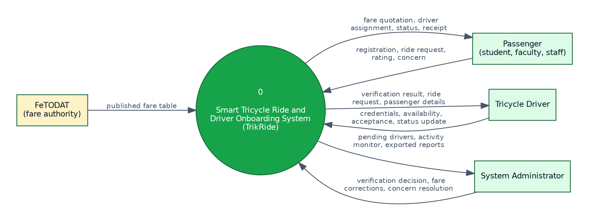{width=6.0in}

### Data Flow Diagram

Decomposing the single process of the context diagram gives six processes and seven data stores.

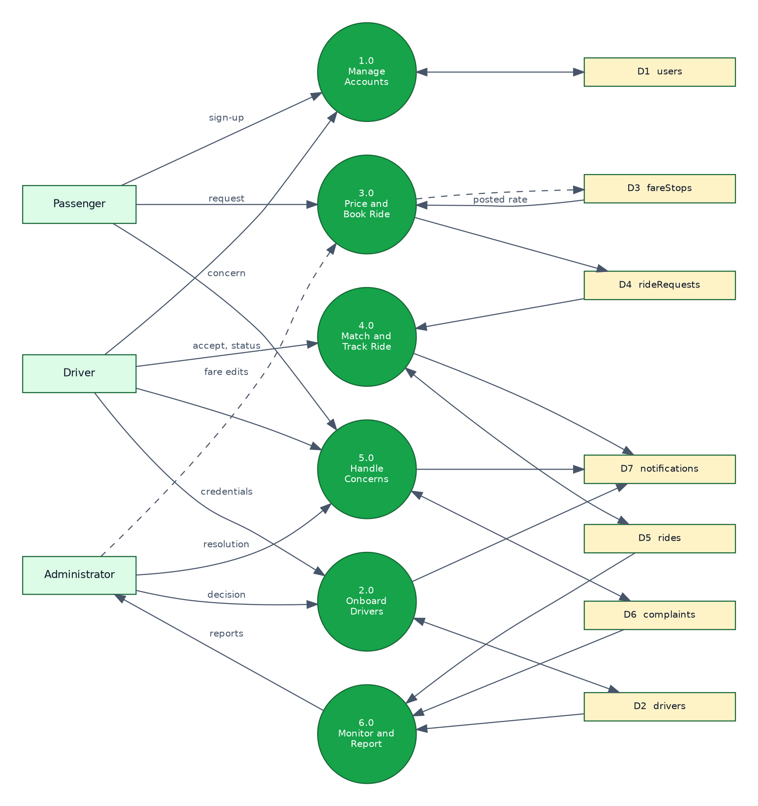{width=6.0in}

### Entity Relationship Diagram

Although the Realtime Database is not relational, the entities it holds and the relationships between them can be expressed in the same terms, which is what the following diagram does. Relationships that would be foreign keys in a relational database are stored as identifier fields. A user's profile photograph is held in a separate `profilePhotos` node keyed by the same identifier, and a driver's licence photograph in a separate `driverDocuments` node, for the reasons given in Sections 3.5 and 3.8.

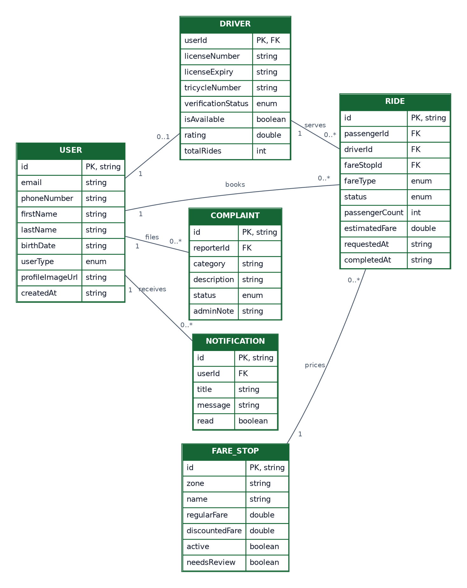{width=5.89in}

### Use Case Diagram

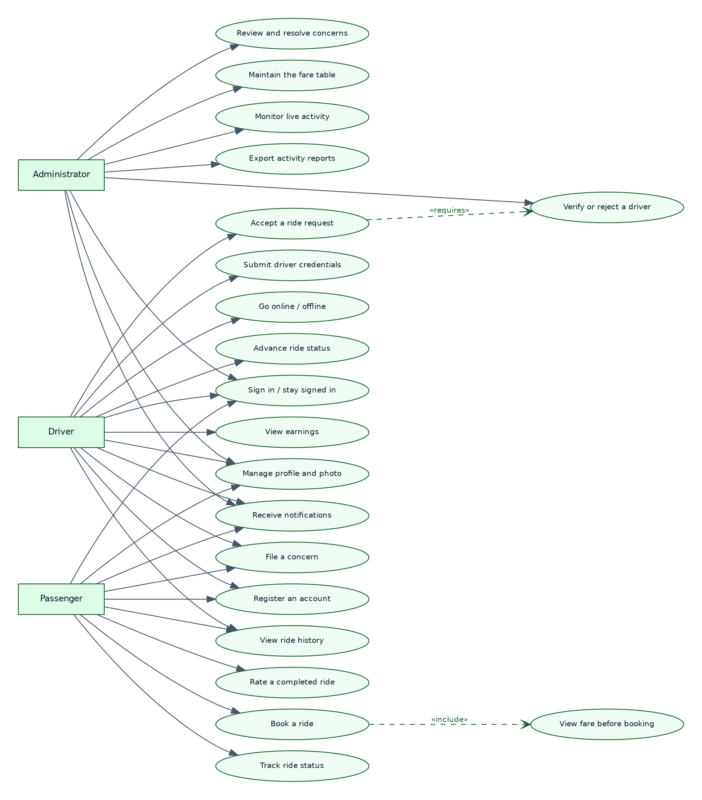{width=6.0in}

### Activity Diagram

The activity diagram traces the booking process, the central transaction of the system, including the points at which it can end without a ride.

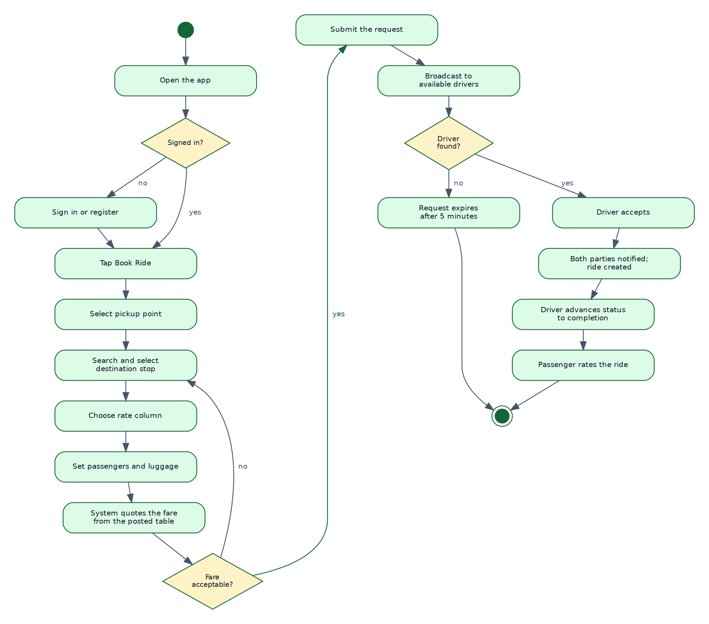{width=6.0in}

### Sequence Diagram

The sequence diagram shows the same transaction as an exchange between components over time, distinguishing calls made by the application from changes pushed by the database to live listeners. The pushed changes are what make the two devices agree without either polling the other.

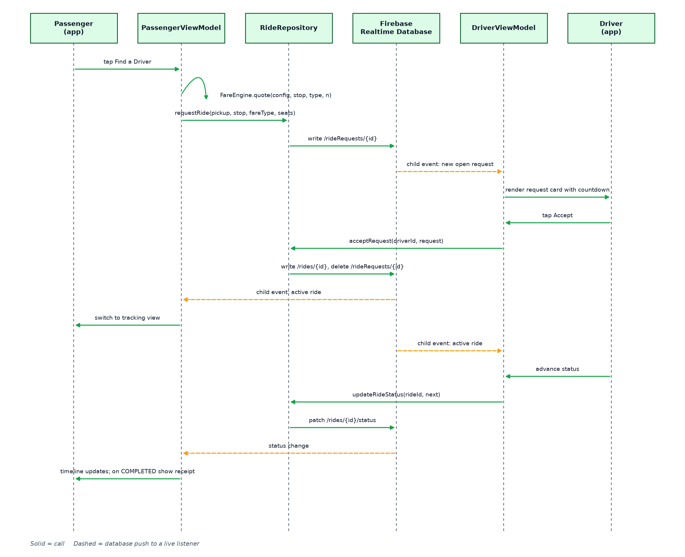{width=6.0in}

### Class Diagram

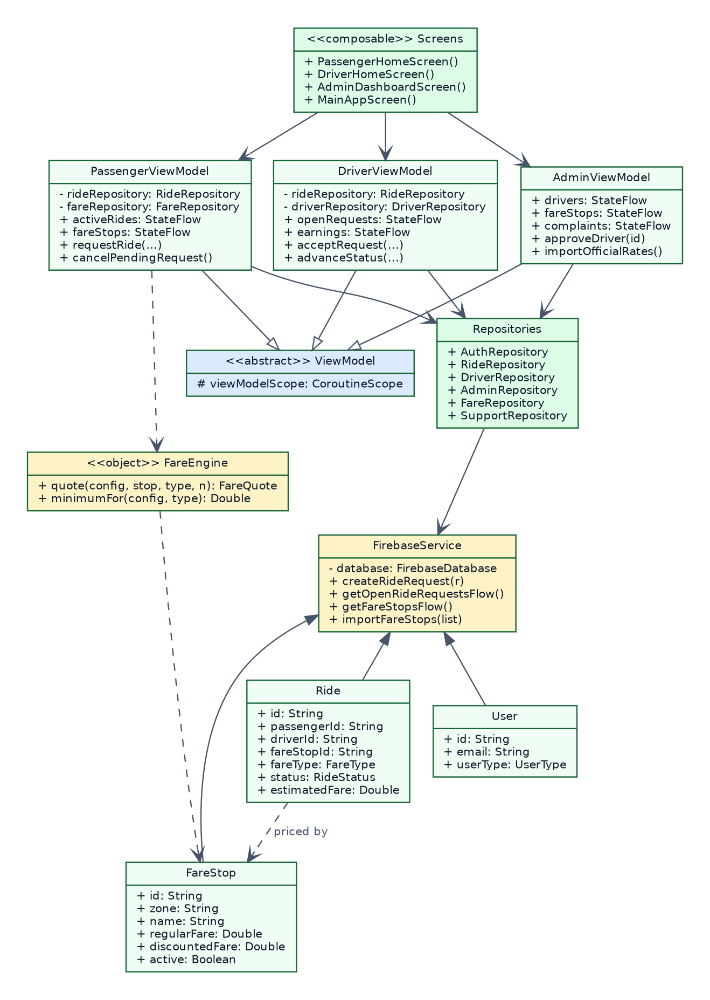{width=5.26in}

### Database Design

The database is a JSON tree with seven top-level nodes.

: Table 8. Realtime Database Node Structure

| Node | Key | Contents | Written by |
|:---|:---|:---|:---|
| `users` | user identifier | Email, mobile number, given and family name, date of birth, role, accepted document versions and the time of acceptance, timestamps | The account holder |
| `drivers` | user identifier | Tricycle number, verification status, availability, rating, ride count, and a flag recording whether a licence photograph is on file | The driver; verification status by an administrator |
| `rideRequests` | request identifier | Passenger identifier, pickup, destination, passenger count, luggage, priced fare, fare stop, rate column, requested and expiry timestamps | The passenger; deleted on acceptance or expiry |
| `rides` | ride identifier | Passenger and driver identifiers, pickup, destination, status, fares, fare stop, rate column, lifecycle timestamps, passenger count, luggage, notes | The system on acceptance; status by the driver |
| `config/fare` | fixed | Minimum regular fare, minimum discounted fare, flat rates, per-passenger flag, source citation, seed timestamp | An administrator |
| `config/fareStops` | stop identifier | Zone, name, regular rate, discounted rate, active flag, review flag, transcription confidence, note | An administrator |
| `complaints` | complaint identifier | Reporter identifier, name and role, category, description, status, administrator note, timestamps | The reporter; status and note by an administrator |
| `notifications` | user identifier, then notification identifier | Title, message, type, read flag, timestamp | The system |
| `profilePhotos` | user identifier | Base64 JPEG thumbnail and the time it was set | The account holder |
| `driverDocuments` | user identifier | Licence number and expiry, a base64 JPEG of the licence, the time it was sent, and the time consent was given | The driver; the photograph deleted by an administrator on refusal |
| `driverRatings` | driver identifier, then rater identifier | One star rating, from one to five | The passenger who gave it |

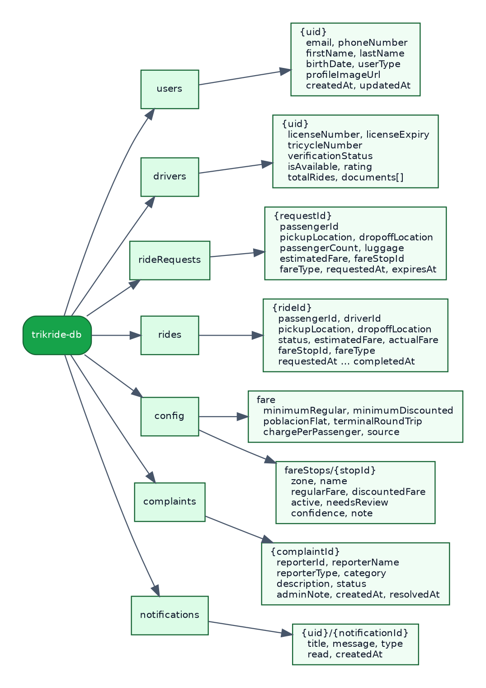{width=4.83in}

The fare table as seeded from the published FeTODAT schedule comprises 240 destinations across twelve zones.

: Table 9. Fare Table Composition by Zone

| Zone | Stops | Flagged for verification | Disabled |
|:---|---:|---:|---:|
| Balintawak | 31 | 1 | 0 |
| Santo Niño | 38 | 0 | 0 |
| San Francisco | 21 | 8 | 0 |
| San Agustin | 16 | 0 | 0 |
| Bagacay, Burgos and Rizal | 16 | 0 | 0 |
| Zamora | 22 | 0 | 0 |
| San Carlos | 10 | 10 | 0 |
| Tanghaligue | 14 | 3 | 0 |
| San Isidro | 32 | 3 | 1 |
| San Jose | 14 | 14 | 0 |
| San Pedro | 11 | 3 | 0 |
| San Roque | 15 | 4 | 2 |
| **Total** | **240** | **46** | **3** |

Regular rates in the seeded table run from ₱20.00 to ₱150.00 with a mean of ₱41.00, against a minimum fare of ₱25.00 for regular passengers and ₱20.00 for discounted passengers. Twenty-seven entries carry a transcribed rate of ₱20.00, below that minimum, and are raised to it when a ride is priced. Whether those entries record a rate that has since been superseded or were read incorrectly is a question for verification against the posted sheet; either way the system charges the minimum rather than the lower figure. In addition to the 240 destinations, the schedule fixes two flat rates that are not tied to a numbered stop: ₱25.00 for any point within Poblacion — offered under that name because the schedule has no numbered stop for it — and ₱25.00 for the round trip between the Talibon Integrated Bus Terminal and NCBI. Both are offered to passengers as destinations in their own right.

Forty-six entries carry a verification flag. These are rows that could not be read from the posted sheet with full confidence, rows where two transcription passes disagreed, and rows that are internally inconsistent, such as four entries where the discounted rate exceeds the regular rate. Three entries are disabled because no usable rate could be read: one where the fare was cut off at the edge of the photograph, one where only the discounted rate was legible, and one where the transcribed regular rate of ₱740.00 falls so far outside the range of every neighbouring entry that it was treated as a misprint rather than a price. A disabled entry cannot be selected by a passenger and therefore cannot price a ride. The administrative interface lists flagged entries separately so that they can be checked against the physical sheet and cleared.

This treatment is a deliberate design position. The alternative, which is to enter every transcribed number and let the application charge whatever was read, would produce a system that is wrong quietly. Flagging uncertainty and disabling unusable entries makes the system wrong loudly, which is the failure mode that can be corrected.

### Interface Design

The interface follows Material 3 with a green palette derived from the college's colours, and supports both light and dark themes. Navigation is by a bottom bar of four tabs for passengers and drivers and five for administrators, which keeps every primary destination one tap from every other.

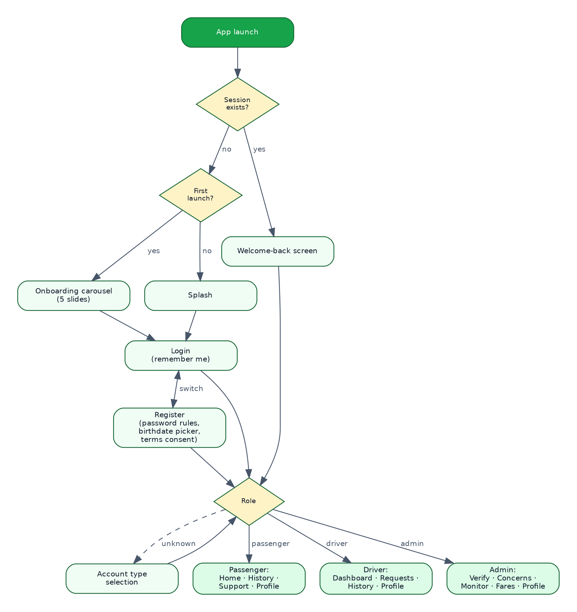{width=6.0in}

Several decisions in the interface follow from constraints identified during design. The destination picker is a full-screen searchable list rather than a dropdown, because a dropdown of 240 entries is unusable. The driver's request card carries a countdown, because a driver deciding whether to accept needs to know how long the decision remains available. Lists show skeleton placeholders while loading rather than an empty screen, because an empty screen reads as a failure. The fare is itemized rather than given as a single figure, because a passenger who can see how the number was reached can check it against the posted sheet.

## 4.4 Software Development

### Development Approach

Development proceeded through the phases of the Waterfall model shown in Figure 12, with the implementation phase organized into successive modules so that each could be tested before the next was begun.

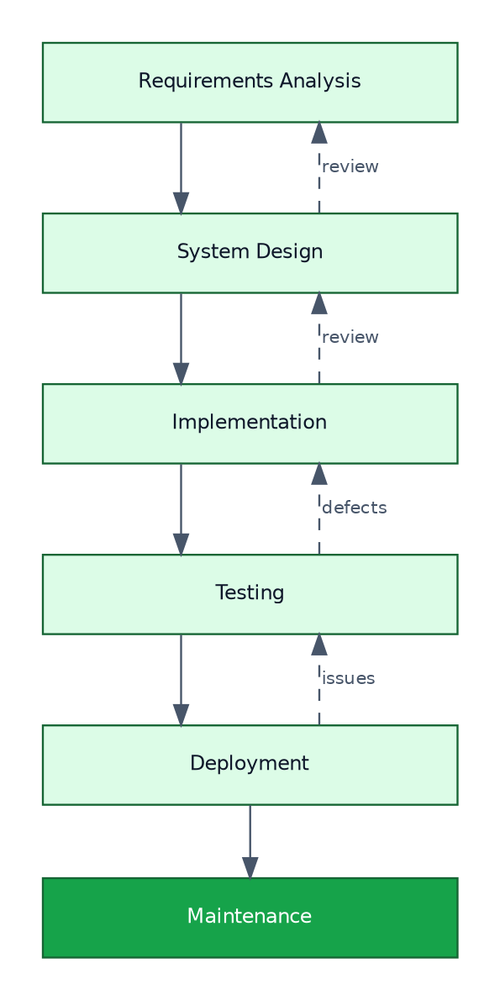{width=3.7in}

: Table 10. Development Milestones and Deliverables

| Milestone | Deliverable | Verification |
|:---|:---|:---|
| Project scaffolding | Gradle build, Firebase configuration, theme, navigation shell | Application builds and launches |
| Authentication | Registration, sign-in, session persistence, password policy, terms consent | An account can be created and survives a restart |
| Role routing | Account type selection and role-based navigation | Each role reaches its own interface |
| Passenger booking | Pickup and destination selection, fare display, request submission | A request is written to the database |
| Driver matching | Availability toggle, request list with countdown, acceptance | A request accepted by one driver disappears from another's device |
| Ride lifecycle | Status progression, shared tracking view, completion and rating | Both devices show the same status |
| Driver onboarding | Credential submission, administrator verification, gating | An unverified driver cannot accept a request |
| Concerns and notifications | Concern submission, administrative review, notification centre | A concern reaches the administrator and a response reaches the reporter |
| Fare table | Seed import, search, filter, edit, review queue, global rates | 240 stops load and price rides correctly |
| Reporting | Period selection, summary, three report types, export and share in both formats | The spreadsheet opens in a spreadsheet application and the document prints legibly |
| Refinement | Profile photographs, onboarding carousel, skeleton loading, pull-to-refresh, dark theme | Verified by inspection on device |

### Coding Standards

Kotlin's official style guide was followed throughout. Names describe intent rather than type. Comments explain why a decision was made where the reason is not evident from the code, and are omitted where the code already says what it does. Each file holds one concern. Every screen is a composable function that receives state and emits events, holding no logic of its own.

### Version Control

All work was committed to a Git repository hosted on GitHub, on a dedicated development branch. Commits were made at the completion of each coherent unit of work, producing a history in which any change can be located and, if necessary, reverted.

### Integration

Integration was continuous rather than deferred. Each module was connected to Firebase as it was written, so that failures in synchronization, deserialization, or authorization surfaced immediately rather than accumulating to the end of development. Two classes of defect were found this way and would have been considerably harder to locate later: a mismatch between the package name registered in the Firebase console and the package name in the application, which caused the build to fail at the Google Services processing step; and a database write that never completed because the Realtime Database instance had not been created, which the application originally presented as an indefinite loading indicator and which was corrected by introducing a twelve-second timeout with an actionable message.

## 4.5 Testing

Testing was conducted at four levels, followed by performance and security testing.

### Unit Testing

Unit testing verified individual functions in isolation, concentrating on the logic that produces numbers, since an error there produces a wrong fare rather than a visible failure.

: Table 11. Unit Test Cases and Results

| ID | Test case | Expected result | Result |
|:---|:---|:---|:---|
| UT-01 | Price a regular ride to a stop with a posted rate above the minimum | The posted regular rate is returned | Pass |
| UT-02 | Price a discounted ride to the same stop | The posted discounted rate is returned | Pass |
| UT-03 | Price a ride where the posted rate falls below the ordinance minimum | The minimum for the applicable column is returned and flagged as applied | Pass |
| UT-04 | Price a ride for three passengers with per-head charging enabled | The per-passenger rate multiplied by three is returned | Pass |
| UT-05 | Price a ride for three passengers with per-head charging disabled | The per-passenger rate is returned unmultiplied | Pass |
| UT-06 | Evaluate a password of seven characters | Rejected as too short | Pass |
| UT-07 | Evaluate a password of eight characters with no digit | Rejected | Pass |
| UT-08 | Evaluate a compliant password | Accepted | Pass |
| UT-09 | Bucket a ride timestamped in a given month into that month's report period | The ride is included | Pass |
| UT-10 | Bucket a ride with an unparseable timestamp | The ride is excluded rather than assigned to the current period | Pass |
| UT-11 | Escape a report field containing a comma and a quotation mark | The field is quoted and internal quotes are doubled | Pass |
| UT-12 | Derive available report periods from a set of rides | Only periods containing rides are offered, newest first | Pass |

### Integration Testing

Integration testing verified that components work together and that the application and Firebase agree.

: Table 12. Integration Test Cases and Results

| ID | Test case | Expected result | Result |
|:---|:---|:---|:---|
| IT-01 | Register an account and read it back | The stored record matches what was submitted | Pass |
| IT-02 | Sign in, close the application, and reopen it | The session is restored without re-entering credentials | Pass |
| IT-03 | Submit a ride request from one device | The request appears on a second device signed in as an available driver | Pass |
| IT-04 | Accept a request on one driver device | The request disappears from a second driver device | Pass |
| IT-05 | Advance ride status on the driver device | The passenger device reflects the new status without user action | Pass |
| IT-06 | Load the fare table from the administrative interface | 240 stops are written and appear on a passenger device | Pass |
| IT-07 | Edit a fare on the administrative device | The new rate is used by the next booking on a passenger device | Pass |
| IT-08 | Approve a driver on the administrative device | The driver's device gains the ability to go online, and a notification is received | Pass |
| IT-09 | File a concern from a passenger device | The concern appears in the administrative concerns list with a badge | Pass |
| IT-10 | Upload a profile photograph | The image is stored and the URL is written to the user record | Pass |

### System Testing

System testing exercised complete workflows end to end.

: Table 13. System Test Cases and Results

| ID | Scenario | Expected result | Result |
|:---|:---|:---|:---|
| ST-01 | A new passenger installs the application, sees the carousel, registers, and books a ride | The full path completes and a ride record is created | Pass |
| ST-02 | A new driver registers, submits credentials, is rejected, and attempts to go online | The driver cannot accept requests | Pass |
| ST-03 | The same driver is subsequently approved and accepts a ride | The ride proceeds to completion | Pass |
| ST-04 | A ride request receives no acceptance | The request expires after five minutes and the passenger is returned to booking | Pass |
| ST-05 | A ride is carried through to completion and rated | The ride appears in both parties' history with the correct fare | Pass |
| ST-05a | A driver submits a licence photograph and an administrator refuses the application | The photograph is presented for review, and no longer exists in the database once the refusal is recorded | Pass |
| ST-06 | An administrator exports a monthly ride report as a spreadsheet | The file contains every ride in that month and opens in a spreadsheet application | Pass |
| ST-06a | An administrator exports the same report as a document | The first page carries the summary figures and charts for the month and the following pages carry every ride | Pass |
| ST-06b | An administrator selects a range between two dates and exports the ride report | The report covers every ride from the first day to the last, both days included in full | Pass |
| ST-07 | A returning user reopens the application | The welcome screen is shown and the session is restored to the correct role | Pass |
| ST-08 | The device is rotated during booking | Entered values are retained | Pass |
| ST-09 | The application is used with the device in dark theme | Every screen renders legibly | Pass |
| ST-10 | Connectivity is lost during a booking | The operation fails within twelve seconds with an actionable message | Pass |

### User Acceptance Testing

User acceptance testing is to be conducted with respondents drawn from the two user groups, using the application under real conditions for the evaluation period. Respondents are asked to complete representative tasks without assistance: register an account, book a ride to a named destination, and for drivers, go online and accept a request. Observations and the difficulties encountered were recorded, and the outcomes are reported in Section 4.9 together with the questionnaire results.

*[Task completion rates and observed difficulties are to be recorded following the evaluation period.]*

### Performance Testing

Performance was assessed against the targets in Table 3. Request propagation was measured as the interval between a passenger submitting a request and the request appearing on a driver's device. Destination search was assessed by observation across the full 240-entry table. Application launch time to the first interactive screen was measured on a representative low-specification device.

*[Measured figures are to be recorded following the evaluation period.]*

### Security Testing

: Table 14. Security Test Cases and Results

| ID | Test case | Expected result | Result |
|:---|:---|:---|:---|
| SEC-01 | Attempt to read another user's profile record while signed in as a different user | The read is refused by the database rules | Pass |
| SEC-02 | Attempt to change a driver's verification status while signed in as that driver | The write is refused | Pass |
| SEC-03 | Attempt to write to the fare table while signed in as a passenger | The write is refused | Pass |
| SEC-04 | Attempt to sign in with an incorrect password | Access is denied with a message that does not disclose whether the account exists | Pass |
| SEC-05 | Register with a password that does not meet the policy | Registration is prevented at the interface and the reason is shown | Pass |
| SEC-06 | Inspect the repository for confidential values | No API key, service configuration, or credential is present in version control | Pass |
| SEC-07 | Sign out and attempt to return to a role interface | The user is returned to the sign-in screen | Pass |
| SEC-08 | Inspect network traffic during use | All traffic is encrypted; no plain-text transmission is observed | Pass |
| SEC-09 | Attempt to read another driver's licence photograph while signed in as a passenger | The read is refused by the database rules | Pass |
| SEC-10 | Attempt to read a driver's licence photograph while signed in as a different driver | The read is refused | Pass |
| SEC-11 | Refuse a driver application and then query the document node directly | The photograph has been deleted and the read returns nothing | Pass |
| SEC-12 | Withdraw approval from an approved driver and query the document node | The photograph is retained, since withdrawal is not refusal | Pass |
| SEC-13 | Uninstall the application, reinstall it, and open it | The user is returned to the sign-in screen rather than to a restored session | Pass |
| SEC-14 | Attempt to set one's own account type to administrator | The write is refused by the validation clause on the field | Pass |
| SEC-15 | Attempt to read the ride collection without a query limited to oneself | The read is refused | Pass |
| SEC-16 | Attempt to read a ride belonging to two other users | The read is refused | Pass |
| SEC-17 | Attempt to alter the status of a ride one is not the driver of | The write is refused | Pass |
| SEC-18 | Attempt to read a concern reported by another user | The read is refused | Pass |

## 4.6 Prototype Description

The delivered system is a single Android application that presents one of three interfaces according to the role of the signed-in account.

**On first launch**, a new user is shown an introductory carousel of five screens explaining what the application does. The carousel appears once. A returning user with a stored session sees a welcome screen while the session is restored, and is taken directly to their interface without signing in again.

**A driver who has not yet sent a licence photograph** is asked for one on their dashboard, above everything else on it, since without it they cannot be approved and nothing else on that screen is of use to them. The request moves to the profile screen once a photograph is on file. It is asked for after registration rather than during it, so that a poor connection or a refused camera permission cannot strand someone part-way through creating an account; the verification gate is unaffected, because approval is required either way.

**Before any interface opens**, the application confirms that the account has accepted the current Terms and Conditions, Privacy Policy, and Safety and Community Guidelines, and, for a driver account, the Driver Agreement. Anything outstanding is presented on a consent screen where each document can be opened and read in full and must be ticked individually; the button that continues is disabled until all of them are, and the only other option is to sign out.

**The passenger interface** has four tabs. *Home* shows any ride in progress, or the booking entry point. Booking is a single scrolling screen: pickup point, destination, rate column, passenger count, luggage, and notes, with the itemized fare appearing as soon as a destination is chosen. Submitting a request switches the screen to a searching state, and then to a tracking view with a status timeline once a driver accepts. On completion the passenger is shown a summary and invited to rate the ride. *History* lists completed rides. *Support* provides the concern form and contact details. *Profile* holds profile editing, the photograph picker, the theme switch, the terms and privacy notice, and sign-out.

**The driver interface** has four tabs. *Dashboard* shows the availability toggle, total earnings, and any ride in progress with the button that advances it to its next state. *Requests* lists open requests, each with the route, the fare, the rate column, the passenger count, the declared luggage, and a countdown to expiry. *History* lists completed rides. *Profile* mirrors the passenger's, with the addition of a card showing the driver's credentials and verification status.

**The administrator interface** has five tabs. *Verify* lists driver applications, badged with the number pending, with approve and reject actions. *Concerns* lists reported concerns, badged with the number unresolved, with status and note actions. *Monitor* is divided into a live view showing counts and recent rides, and a reports view offering period selection, a summary, and export in either format. *Fares* presents the fare table with search, zone filters, a review queue, per-entry editing, and the global rates dialog. *Profile* is as for the other roles.

A notification centre is reachable from the passenger and driver home screens, showing an unread count and allowing individual or bulk marking as read.

## 4.7 Implementation Plan

### Deployment

The application is distributed to users as a signed release package. The signing key is generated once and held outside version control; the build reads its location and passwords from the project's environment file and, when they are absent, falls back to the debug key while printing a warning that the resulting package must not be distributed. This arrangement makes it difficult to hand out a build that cannot later be updated, which is the practical consequence of signing with the wrong key.

The keystore is the single artefact of this project that cannot be regenerated. Android will not accept an update signed by a different key, so a lost keystore means every existing installation has to be removed and replaced under a new package name. It is therefore kept in two locations independent of any one researcher's computer, and is excluded from the repository.

Two distribution routes are available and neither requires a paid developer account.

The primary route is **Firebase App Distribution**, which is included in the platform's free tier. Testers are invited by email address and receive a link that installs the application, and subsequent releases are pushed to the same group. App Distribution records which tester installed which version, which provides a verifiable record of participation in the evaluation.

The secondary route is **direct distribution of the installation package**, published as a release on the project's repository and circulated as a link or a QR code. This requires the user to permit installation from outside the application store, so an illustrated installation guide is provided as part of the user manual in Appendix H.

Publication to the Google Play Store was not pursued. It requires a one-time developer registration fee and, for new individual accounts, a closed testing period before public release, neither of which suits the timeline of a capstone study. The application is not architecturally prevented from being published there later.

Backend deployment requires no hardware and no payment method. The Firebase project is created through the web console, the database is initialized, the security rules are published, and the fare table is loaded once through the administrative interface. Authentication, the Realtime Database, Cloud Messaging, and App Distribution are all provided within the platform's free tier; the one service that would require a paid plan, object storage, is not used, for the reason set out in Section 3.5.

### Training

Training is organized by role and kept short, on the reasoning that a system requiring lengthy training in a setting like this one will not be adopted.

**Passengers** receive the introductory carousel within the application and a one-page illustrated guide covering installation, registration, and booking.

**Drivers** receive a hands-on orientation session conducted with the cooperation of the drivers' association, covering installation, registration, credential submission, going online, accepting a request, and advancing a ride to completion. Drivers are the group for whom adoption is least certain and for whom in-person orientation matters most.

**Administrators** receive a session covering driver verification, the fare table including the review queue, concern handling, and report export, together with the administrator section of the user manual.

### Maintenance

**Corrective maintenance** addresses defects reported during and after the evaluation. Reports arrive through the in-application concern form under the application problem category, which places them in front of the administrator without a separate channel.

**Data maintenance** is the ongoing correction of the fare table. The forty-six flagged entries are to be checked against the physical posted sheet and cleared, and the three disabled entries are to be given rates or removed. When the drivers' association revises its schedule, the administrator amends the affected entries; no new release of the application is required.

**Adaptive maintenance** covers changes required by new Android versions and by changes to the Firebase platform. Google requires applications distributed through the Play Store to target a recent API level, which is a consideration should publication there be pursued.

**Handover.** The source code, this documentation, the database schema, and the administrator credentials are turned over to Talibon Polytechnic College at the conclusion of the study, so that the system does not depend on the continued availability of the researchers.

## 4.8 Implementation Results

### Modules Delivered

: Table 15. Application Modules and Their Functions

| Module | Functions delivered | Requirements met |
|:---|:---|:---|
| Authentication and onboarding | Registration with password policy and document consent, a consent gate that blocks the dashboard until the current documents are accepted, the Driver Agreement for driver accounts, sign-in, session persistence, remembered email, password reset, introductory carousel, welcome screen | FR-01 to FR-05, FR-07, FR-08 |
| Profile | Profile editing, photograph capture and selection, theme preference, terms and privacy notice, sign-out | FR-06 |
| Passenger booking | Pickup selection, searchable destination picker across 240 stops plus two flat rates, destination selection from the map by nearest posted stop, rate column selection, passenger count and luggage, itemized fare display, request submission and cancellation | FR-09 to FR-14 |
| Matching | Broadcast of requests to available verified drivers, five-minute expiry, first-acceptance matching with withdrawal from other devices | FR-15 to FR-17 |
| Mapping and location | Interactive maps on the booking and tracking screens, rendered by Google Maps or OpenStreetMap according to configuration; live publication of a driver's position while online; the passenger's view of that position; pinning a pickup point on the map with a reverse-geocoded label; naming the posted stop nearest a point the passenger indicates; optional coordinates on fare stops | FR-09, FR-10a, FR-18 |
| Ride lifecycle | Shared status timeline through arriving, arrived, in progress, and completed; completion summary and rating; ride history for both parties | FR-18 to FR-20, FR-25 |
| Driver onboarding | Credential submission, administrative verification with approval and rejection, gating of unverified drivers, notification of the decision | FR-21, FR-22, FR-27, FR-28 |
| Driver operations | Availability toggle, request list with countdown, earnings total | FR-23, FR-24, FR-26 |
| Fare administration | Single-operation import of the published schedule, search, zone filtering, review queue, per-entry editing, activation and deactivation, addition and deletion, global minimums and flat rates | FR-29 to FR-32 |
| Concerns | Categorized concern submission by passengers and drivers, administrative review with status and note, notification of resolution | FR-33, FR-34 |
| Notifications | In-application notification centre with unread count, individual and bulk marking as read | FR-35 |
| Driver verification | Licence photograph submission with consent recorded at the point of upload, administrator review of the photograph against the entered details, approval, refusal with immediate deletion of the photograph, and withdrawal by the driver | FR-08a, FR-08b, NFR-10a |
| Monitoring and reporting | Live counts and recent activity, period selection, summary statistics, three report types, document and spreadsheet export through the file picker and sharing | FR-36 to FR-39 |

All forty-three functional requirements were implemented, as were the seventeen non-functional requirements.

### Reports Generated

: Table 16. Reports Generated by the System

| Report | Period options | Contents |
|:---|:---|:---|
| Ride activity | Any month with rides, any year with rides, the whole record, or a range between two chosen dates | Summary block giving total rides, completions, cancellations, open rides, gross fares, average completed fare, passengers served, and drivers with at least one ride; followed by one line per ride giving both parties, all lifecycle timestamps, route, passenger count, luggage, status, and fares |
| Driver performance | As above | One line per driver with at least one ride in the period, giving contact and vehicle details, verification status, rides accepted, completed, and cancelled, gross and average fares, and rating, ordered by rides accepted; followed by a list of drivers with no rides in the period |
| Concerns | As above | Counts by status, a breakdown by category, and one line per concern giving the reporter, category, description, status, administrator note, and the dates filed and resolved |

Each report is produced in two formats. The comma-separated-value file opens without conversion in Microsoft Excel, Google Sheets, and LibreOffice Calc, and suits an administrator who wants to sort or total the figures themselves. The portable-document-format file is the one to print or hand over: its first page carries the headline figures as labelled tiles and four charts of the period, and the pages behind it carry the same detail as the spreadsheet, laid out as a table with its column headings repeated on every page.

: Table 17. Charts on the Summary Page of Each Report

| Report | Charts |
|:---|:---|
| Ride activity | Rides per day across the month, or per month across a year; rides by hour of the day; the most-booked destinations; and rides by day of the week |
| Driver performance | Rides accepted per driver; gross fares per driver; the share of each driver's accepted rides that were completed; and the registered fleet by approval state |
| Concerns | Concerns by category; concerns filed per month; how long resolved concerns took to close; and the roles of those who raised them |

The months and years offered to the administrator are built from the rides that exist, so no empty period appears in the list. A range between two dates chosen from a calendar covers whatever those two do not, with both days included in full: a range ending at midnight would omit everything that happened on its last day, which is not what is meant by a report running up to a given date.

Charts follow the length of the period rather than its kind. A month, or a range up to nine weeks, is drawn with one bar per day; anything longer is collapsed to one bar per month, since a year of daily bars is unreadable at this page size. Where a period crosses into a new year, the month labels carry the year, so that two Januaries are not shown as the same bar.

The pages are Letter landscape. Landscape was chosen because the ride table carries nine columns, and fitting those onto portrait would mean either a font too small to read or dropping the columns that make the table worth printing.

Every chart draws a single series in one colour. Colouring each bar differently would only repeat, in hue, the quantity the bar's length already shows, and it would introduce the difficulty that several colours side by side present to a reader with colour-vision deficiency or a greyscale printer. Each bar instead carries its own value printed at its end, since a printed page offers nothing to hover over.

Either format may be saved to a location chosen by the administrator through the system file picker, or shared directly to another application. Neither route requires a storage permission. The document is drawn using the `PdfDocument` class in the Android framework, so the feature adds no third-party dependency and no cost.

### Screenshots

System screenshots are presented in Appendix G.

[[PB]]

# Chapter 5 {-}

# SUMMARY, CONCLUSIONS AND RECOMMENDATIONS

## 5.1 Conclusions

Two conclusions can be stated independently of the evaluation results, because they rest on what was built rather than on how it was received.

First, an ordinance-fixed fare regime can be represented faithfully in a ride-hailing application. The reviewed literature describes systems that price by distance, time, or demand, none of which is lawful where a municipal ordinance fixes the price per destination. Implementing the published schedule as a maintainable data table, with statutory minimums and a discounted rate column, demonstrates that a digital platform can operate inside such a regime rather than around it.

Second, transcription of a physically posted fare schedule is a data quality problem that must be handled explicitly. Of the 241 rows on the posted sheet, forty-six could not be read with full confidence and three carried no usable rate. Designing the system to flag the former and disable the latter, rather than to accept every transcribed number, means that uncertainty in the source data does not become a wrong fare charged to a passenger.

## 5.2 Recommendations

Based on the development and evaluation of the system, the following are recommended.

**To the Federation of Tricycle Operators and Drivers Association of Talibon.** Verify the forty-six flagged entries in the fare table against the original ordinance and against the physical posted sheet, and resolve the three entries that carry no usable rate. Four entries currently price the discounted rate above the regular rate, which is the reverse of what the ordinance intends and should be corrected before the system is used beyond the study. Consider supplying the schedule in digital form, which would remove transcription from the process entirely.

**To Talibon Polytechnic College.** Designate a member of staff as system administrator, with responsibility for driver verification, fare maintenance, and concern handling. The system is designed so that this is a light and occasional duty rather than a role, but it does require a named person; a system with no administrator will accumulate unverified drivers and unanswered concerns.

**To tricycle drivers.** Keep availability status current. The value of the system to a passenger depends on the online list reflecting who is actually available, and a driver who remains online while not driving degrades the experience for everyone, themselves included.

**To passengers.** Report fare discrepancies through the concern form rather than settling them at the roadside. A reported discrepancy is a correction to the fare table; an unreported one is a recurring dispute.

**To future researchers.** Conduct the evaluation over a longer period than a capstone timeline usually permits. Adoption of a transportation platform is not immediate, and a short evaluation window measures first impressions rather than sustained use. Where possible, collect objective measures of waiting time before and after deployment alongside the perceptual measures the questionnaire provides, since objectives four and five concern actual reductions in waiting and idle time and a Likert scale can only report whether users believe those reductions occurred.

## 5.3 Future Enhancements

The following extensions are outside the scope of this study and are offered to researchers who take the work further.

**Turn-by-turn navigation.** The system shows positions but not routes. Adding guidance would require a routing service, which is billed by every major provider, or a self-hosted open-source routing engine. For journeys of this length the benefit is modest, but it would help a driver unfamiliar with an outlying sitio.

**Coordinates for the whole fare table.** A passenger can already point at the map and be offered the nearest posted stop, but only stops an administrator has positioned can be offered that way, and few have been. Surveying the coordinates of all 240, which a group of students with phones could do in a few afternoons, would make the whole schedule reachable from the map instead of only from the list.

**Background position for drivers.** A driver's position is published only while the application is open. Publishing while it is backgrounded would need a foreground service and a persistent notification, and a considered answer on battery use and on what drivers are willing to have tracked.

**Server-side push notifications.** The application registers with Firebase Cloud Messaging, but delivering a notification to a device on which the application is not running requires a server-side component. A small set of Cloud Functions triggered by database writes would deliver ride requests to drivers whose phones are in their pockets, which is where a driver's phone usually is.

**Object storage for images.** Should a paid plan become available, moving profile photographs to Cloud Storage would allow full-resolution images and would make it practical to require photographs of a driver's licence and registration during onboarding. The present design deliberately avoids this dependency.

**Cashless payment.** Integration with a Philippine payment provider would remove the need for exact change, which is a recurring friction in tricycle transactions. This was excluded from the present study by scope and would require attention to the regulatory obligations that handling payments imposes.

**Scheduled and recurring bookings.** A student with a fixed class timetable takes the same trip at the same time several days a week. Allowing a booking to be placed in advance, or to repeat, would serve that pattern directly.

**Ride sharing between passengers with the same destination.** A tricycle carrying five passengers to the same zone is more efficient for everyone than five separate trips, and the fare table already prices per head.

**SMS fallback.** Not every prospective user owns a smartphone. An SMS interface for requesting a ride would extend the system to feature phones, which remain common among the older drivers and passengers the study encountered.

**Analytics for the drivers' association.** The ride records already collected would support analysis of demand by hour, by day, and by zone. That analysis would let the association position drivers where passengers actually are, which is a use of the data beyond the reporting the present system provides.

**Biometric or document-image verification.** Driver verification currently rests on typed credentials reviewed by an administrator. Requiring photographs of the licence and the registration, and checking them against the typed values, would strengthen the onboarding gate.

**Public release.** Publication to the Google Play Store would remove the installation friction of distributing an installation package directly, at the cost of a developer registration fee and compliance with the store's review requirements.

[[PB]]
# REFERENCES

Cheng, Y., Protopapas, N., Yazdanpanah, V., Gerding, E., & Stein, S. (2024). Fair and efficient ride-scheduling: A preference-driven approach. *Autonomous Agents and Multi-Agent Systems*. https://doi.org/10.1007/s10458-024-09625-5

Dastani, Z., Koosha, H., Karimi, H., & Moghaddam, A. (2024). User preferences in ride-sharing mathematical models for enhanced matching. *Scientific Reports, 14*. https://doi.org/10.1038/s41598-024-78469-1

Davis, F. D. (1989). Perceived usefulness, perceived ease of use, and user acceptance of information technology. *MIS Quarterly, 13*(3), 319–340. https://doi.org/10.2307/249008

DeLone, W. H., & McLean, E. R. (2003). The DeLone and McLean model of information systems success: A ten-year update. *Journal of Management Information Systems, 19*(4), 9–30. https://doi.org/10.1080/07421222.2003.11045748

Federation of Tricycle Operators and Drivers Association of Talibon. (2022). *Ordinance amending Section 1 of Municipal Ordinance No. 2018-05, the revised ordinance fixing the adjusted fare rates of all tricycles operating within the territorial jurisdiction of the Municipality of Talibon*. Municipality of Talibon, Bohol.

Goodhue, D. L., & Thompson, R. L. (1995). Task-technology fit and individual performance. *MIS Quarterly, 19*(2), 213–236. https://doi.org/10.2307/249689

Huang, X., Li, Z., & Chen, Y. (2024). Optimizing routing and scheduling of shared autonomous electric taxis considering capacity constrained parking facilities. *Sustainable Cities and Society, 111*, 105557. https://doi.org/10.1016/j.scs.2024.105557

International Organization for Standardization. (2011). *ISO/IEC 25010:2011 — Systems and software engineering — Systems and software Quality Requirements and Evaluation (SQuaRE) — System and software quality models*. ISO.

Kumar, P., & Singh, R. (2023). Digital ride-hailing platforms and urban transportation sustainability. *Journal of Urban Mobility, 5*, 100074. https://doi.org/10.1016/j.urbmob.2023.100074

Li, Y., Zhang, H., & Wang, S. (2024). Optimizing first- and last-mile ridesharing services with heterogeneous vehicle fleets. *Transportation Research Part E*. https://doi.org/10.1016/j.tre.2024.103642

Narayanan, S., & Antoniou, C. (2021). A systematic literature review of ride-sharing platforms, user factors and barriers. *European Transport Research Review, 13*(61). https://doi.org/10.1186/s12544-021-00522-1

Rapp, D., Bräunl, T., & Collett, T. (2023). On-demand ride sharing: Scheduling of an autonomous bus fleet for last-mile travel. *Robotics and Autonomous Systems, 170*, 104559. https://doi.org/10.1016/j.robot.2023.104559

Republic of the Philippines. (2012). *Republic Act No. 10173: An act protecting individual personal information in information and communications systems in the government and the private sector, creating for this purpose a National Privacy Commission, and for other purposes* (Data Privacy Act of 2012). Official Gazette. https://www.officialgazette.gov.ph/2012/08/15/republic-act-no-10173/

Wang, H., Zhang, J., & Li, Q. (2022). Intelligent transportation systems and smart mobility solutions for urban transportation management. *IEEE Access, 10*, 49792–49805. https://doi.org/10.1109/ACCESS.2022.3172017

Zhang, L., Li, Y., & Chen, X. (2021). Development of mobile ride-hailing platforms and their impact on urban mobility. *Journal of Transportation Technologies, 11*(3), 432–445. https://doi.org/10.4236/jtts.2021.113028

[[PB]]

# APPENDICES

## Appendix A — Research Instruments

The instruments used in this study are the needs assessment questionnaire, administered before development to document the problems in the current arrangement, and the system evaluation questionnaire, administered after a period of use to evaluate the developed system. The evaluation questionnaire is reproduced in full as Appendix C. The needs assessment questionnaire is reproduced below.

**NEEDS ASSESSMENT QUESTIONNAIRE**

*A Smart Tricycle Ride and Driver Onboarding System for Talibon Polytechnic College*

**General Instruction.** This questionnaire gathers data on the current tricycle transportation arrangement serving Talibon Polytechnic College. Please answer honestly. Responses are confidential and are used for research purposes only.

*Part I — Respondent Profile*

Role: Passenger ☐  Driver ☐   Sex: Male ☐ Female ☐   Age: ______

For passengers — How often do you take a tricycle to or from the campus?
Daily ☐  Three to four times a week ☐  Once or twice a week ☐  Rarely ☐

For drivers — How many years have you been driving a tricycle in Talibon? ______

*Part II — Current Situation*

1. On a typical day, how long do you wait for a tricycle (passengers) or for a passenger (drivers)?
   Under 5 minutes ☐  5 to 10 minutes ☐  11 to 20 minutes ☐  Over 20 minutes ☐

2. How do you usually find a ride, or find passengers?
   Terminal queue ☐  Roadside ☐  Calling a driver you know ☐  Other: ____________

3. Do you know the official FeTODAT fare for the destinations you travel to most often?
   Yes, all of them ☐  Some ☐  No ☐

4. Have you ever been unsure whether the fare charged was correct?
   Often ☐  Sometimes ☐  Never ☐

5. For passengers — Do you know whether the driver carrying you holds a valid licence and registration?
   Always ☐  Sometimes ☐  Never ☐

6. Would you use a mobile application to book a tricycle if one were available?
   Yes ☐  No ☐  Unsure ☐

7. What would most discourage you from using such an application?
   Cost of mobile data ☐  Difficulty using a phone application ☐  Preference for the current arrangement ☐  Other: ____________

*Part III — Open Response*

8. What is the single biggest problem with tricycle transportation around the campus?

9. What would you most want a booking application to do?

[[PB]]

## Appendix B — Letter of Permission

*[Two letters are required and are to be inserted here as signed copies.]*

**Letter 1 — To the College President, Talibon Polytechnic College**, requesting permission to conduct the study within the institution, to administer the needs assessment and evaluation questionnaires to students, and to deploy the application to student respondents for the evaluation period.

**Letter 2 — To the President, Federation of Tricycle Operators and Drivers Association of Talibon**, requesting permission to conduct the study among member drivers, to administer the questionnaires, to deploy the application to driver respondents, and to reproduce the association's published fare schedule within the application.

## Appendix C — Survey Questionnaire

**SYSTEM EVALUATION QUESTIONNAIRE**

*A Smart Tricycle Ride and Driver Onboarding System for Talibon Polytechnic College*

**General Instruction.** This questionnaire gathers data for the study titled "A Smart Tricycle Ride and Driver Onboarding System for Talibon Polytechnic College." Please answer all items honestly and completely. Your responses will be treated with strict confidentiality and used for research purposes only.

**Rating Scale**

| Weight | Weighted Mean | Response |
|:---:|:---|:---|
| 5 | 4.21 – 5.00 | Strongly Agree |
| 4 | 3.41 – 4.20 | Agree |
| 3 | 2.61 – 3.40 | Neutral |
| 2 | 1.81 – 2.60 | Disagree |
| 1 | 1.00 – 1.80 | Strongly Disagree |

### I — For Passengers (Students)

Name (Optional): _____________________________    Role: Passenger

Sex: Male ☐  Female ☐    Age: _________

**Directions.** For each statement below, indicate the extent of your agreement by placing a check in the appropriate column. There is no right or wrong answer. Responses are confidential and used for research purposes only. This questionnaire evaluates the system against ISO/IEC 25010 software quality characteristics. Rate each statement based on your actual experience using the system.

**Part II — System Evaluation**

**A. Usability**

| No. | Statement | 5 | 4 | 3 | 2 | 1 |
|:---:|:---|:-:|:-:|:-:|:-:|:-:|
| 1 | The system is easy to navigate and use. | | | | | |
| 2 | The interface is clean and visually understandable. | | | | | |
| 3 | I was able to book a ride without difficulty. | | | | | |
| 4 | The instructions and labels in the system are clear and easy to understand. | | | | | |
| 5 | I can comfortably use the system without any technical assistance. | | | | | |

**B. Functionality**

| No. | Statement | 5 | 4 | 3 | 2 | 1 |
|:---:|:---|:-:|:-:|:-:|:-:|:-:|
| 1 | The ride booking feature works as expected. | | | | | |
| 2 | I receive timely notifications about my ride status. | | | | | |
| 3 | The system accurately matches me with an available driver. | | | | | |
| 4 | I can view the status of my booking in real time. | | | | | |
| 5 | The fare shown matches the official FeTODAT rate for my destination. | | | | | |

**C. Efficiency**

| No. | Statement | 5 | 4 | 3 | 2 | 1 |
|:---:|:---|:-:|:-:|:-:|:-:|:-:|
| 1 | The system reduces my waiting time for a tricycle ride. | | | | | |
| 2 | Booking a ride through the system is faster than the manual process. | | | | | |
| 3 | The system responds quickly to my inputs and requests. | | | | | |
| 4 | The system helps me get a ride more conveniently. | | | | | |
| 5 | Overall, the system improves my transportation experience. | | | | | |

**D. Reliability**

| No. | Statement | 5 | 4 | 3 | 2 | 1 |
|:---:|:---|:-:|:-:|:-:|:-:|:-:|
| 1 | The system works consistently without errors or crashes. | | | | | |
| 2 | I can depend on the system to connect me with a driver when needed. | | | | | |
| 3 | The system maintains accurate and up-to-date information. | | | | | |
| 4 | The system performs well even during peak hours. | | | | | |
| 5 | I trust the system to provide a safe and reliable ride booking experience. | | | | | |

**Part III — Open-Ended Questions**

1. What feature do you like most about the system?
2. What problems or limitations did you observe?
3. What improvements would you recommend?
4. Other comments or suggestions:

[[PB]]

### II — For Tricycle Drivers

Name (Optional): _____________________________    Role: Driver

Sex: Male ☐  Female ☐    Age: _________

**Directions.** For each statement below, indicate the extent of your agreement by placing a check in the appropriate column. There are no right or wrong answers. Responses are confidential and used for research purposes only. This questionnaire evaluates the system against ISO/IEC 25010 software quality characteristics. Rate each statement based on your actual experience using the system.

**Part II — System Evaluation**

**A. Usability**

| No. | Statement | 5 | 4 | 3 | 2 | 1 |
|:---:|:---|:-:|:-:|:-:|:-:|:-:|
| 1 | The system is easy to navigate and use. | | | | | |
| 2 | The interface is clean and visually understandable. | | | | | |
| 3 | I was able to register and set up my account without difficulty. | | | | | |
| 4 | The instructions and labels in the system are clear and easy to understand. | | | | | |
| 5 | I can comfortably use the system without any technical assistance. | | | | | |

**B. Functionality**

| No. | Statement | 5 | 4 | 3 | 2 | 1 |
|:---:|:---|:-:|:-:|:-:|:-:|:-:|
| 1 | The ride request feature works as expected. | | | | | |
| 2 | I receive timely notifications about incoming ride requests. | | | | | |
| 3 | The system accurately shows my availability status to passengers. | | | | | |
| 4 | I can manage and track my rides through the system in real time. | | | | | |
| 5 | The verification process for my credentials worked as expected. | | | | | |

**C. Efficiency**

| No. | Statement | 5 | 4 | 3 | 2 | 1 |
|:---:|:---|:-:|:-:|:-:|:-:|:-:|
| 1 | The system reduces my idle time waiting for passengers. | | | | | |
| 2 | Managing ride requests through the system is faster than the manual process. | | | | | |
| 3 | The system responds quickly to my inputs and actions. | | | | | |
| 4 | The system helps me serve more passengers throughout the day. | | | | | |
| 5 | Overall, the system improves my daily work experience as a driver. | | | | | |

**D. Reliability**

| No. | Statement | 5 | 4 | 3 | 2 | 1 |
|:---:|:---|:-:|:-:|:-:|:-:|:-:|
| 1 | The system works consistently without errors or crashes. | | | | | |
| 2 | I can depend on the system to deliver ride requests accurately. | | | | | |
| 3 | The system maintains accurate and up-to-date information. | | | | | |
| 4 | The system performs well even during busy hours. | | | | | |
| 5 | I trust the system to support my work as a registered driver. | | | | | |

**Part III — Open-Ended Questions**

1. What feature do you like most about the system?
2. What problems or limitations did you observe?
3. What improvements would you recommend?
4. Other comments or suggestions:

[[PB]]

## Appendix D — Legal Documents Presented In-App

Four documents are carried inside the application and are readable at any time from the
profile screen. The Terms and Conditions, the Privacy Policy and the Safety and Community
Guidelines must each be accepted before the service becomes available; the Driver
Agreement is presented to a driver after they choose a driver account. Acceptance is
recorded against a version string, so that a revision asks every existing user again on
their next launch.

They are reproduced below as issued. The text held in the application is the copy of
record, since it is what a user reads before agreeing; its source is
`app/src/main/java/com/tpc/trikride/ui/screens/LegalScreen.kt`, and Markdown copies
generated from it are in `docs/legal/` of the repository given in Appendix I.

[[PB]]

### D.1 Terms and Conditions

*Effective Date: July 28, 2026*

By creating an account or using TrikRide, you agree to comply with these Terms and Conditions.

**1. Eligibility**

Users must be:
- Registered students, faculty, or authorized personnel of the participating institution.
- Registered and approved drivers for driver accounts.

**2. Account Registration**

Users agree to:
- Provide accurate and complete information.
- Maintain only one active account unless otherwise authorized.
- Keep login credentials confidential.
- Notify the administrator immediately if they suspect unauthorized access to their account.

**3. Ride Booking**

Passengers agree to:
- Enter accurate pickup and destination locations.
- Be present at the designated pickup point on time.
- Treat drivers and fellow passengers with courtesy and respect.

Drivers agree to:
- Maintain valid registration and any required permits.
- Arrive at pickup locations promptly whenever possible.
- Provide safe, respectful, and professional service.
- Follow all applicable traffic laws and institutional policies.

**4. Prohibited Activities**

Users shall not:
- Create fake or fraudulent accounts.
- Impersonate another person.
- Submit false booking requests.
- Harass, threaten, or discriminate against other users.
- Attempt unauthorized access to the system.
- Use the application for illegal or unlawful activities.

Violations may result in temporary suspension or permanent removal from the TrikRide platform.

**5. Limitation of Liability**

TrikRide is a ride scheduling and driver matching platform. While we strive to provide reliable service, we cannot guarantee uninterrupted availability and are not responsible for delays caused by traffic, weather, vehicle issues, or other circumstances beyond our reasonable control.

**6. Account Suspension**

The system administrator reserves the right to suspend or terminate accounts found to be in violation of these Terms and Conditions.

**7. Intellectual Property**

All application content, including the TrikRide name, logo, interface design, graphics, source code, and documentation, is owned by the TrikRide development team unless otherwise stated. Unauthorized reproduction or distribution is prohibited.

**8. Amendments**

These Terms and Conditions may be updated from time to time. Continued use of TrikRide after changes are published constitutes acceptance of the updated Terms.

**9. Governing Rules**

These Terms shall be governed by applicable Philippine laws and the policies of the participating educational institution.

**10. Acceptance**

By registering and using TrikRide, you confirm that you have read, understood, and agreed to these Terms and Conditions and the Privacy Policy.

[[PB]]

### D.2 Privacy Policy

*Effective Date: August 16, 2026*

**1. Information We Collect**

We collect the information you provide during registration (name, email, phone number, date of birth, and — for drivers — license and tricycle details), an optional profile photo, and information generated while using the app (ride requests, pickup/destination, ride history, and any concerns you report).

Drivers are also asked for a photograph of their driver's license. Under the Data Privacy Act of 2012 (Republic Act No. 10173) a license is sensitive personal information, so it is treated separately from everything else in this policy and is covered by section 9 below. You are asked to agree to it specifically at the moment you send it, not merely by accepting this policy.

**2. How We Use Information**

Your information is used to create your account, match passengers with drivers, price rides, support driver verification, and improve the service.

**3. Location**

Location is used to show pickup/destination and, for drivers, availability. Location is only used while you are using the relevant features of the app.

**4. Data Storage**

Account, ride, and profile photo data are stored in Google Firebase. A profile photo is reduced to a small thumbnail before it is stored. Communications with the server are encrypted in transit. TrikRide does not collect card, bank, or any other payment details; fares are paid in cash directly to the driver.

**5. Sharing**

A passenger's ride details are shared with the assigned driver (and vice versa) to complete the ride. Administrators can view driver records and ride logs to operate and monitor the service. We do not sell your personal information.

**6. Your Choices**

You can edit your profile details and sign out at any time. You may request account concerns or corrections through the Support feature.

**7. Children**

The service is intended for members of the college community and is not directed at children under 13.

**8. Contact**

For privacy questions, contact the TrikRide support hotline listed in the app.

**9. Driver's License Photographs**

This section applies only to drivers, and only to the photograph of the license itself.

Purpose. The photograph is used for one thing: to confirm that the person applying to carry passengers holds the license they say they hold, and to check it again when that license expires. It is not used for anything else.

Who can see it. You, and a TrikRide administrator. It is never shown to passengers, never attached to a ride, and never included in any exported report.

How long we keep it. If your application is refused, the photograph is deleted at the moment of that decision. If you are approved, it is kept while your account is active, because it is needed again at renewal and if a concern about a ride is ever disputed. Withdrawing an approval already given is not the same as refusing an application and does not delete the photograph, for that same reason. It is deleted with your account.

Your control. You may remove the photograph yourself at any time from your driver profile. Removing it means you cannot be approved to carry passengers until you provide another one.

How it is stored. Separately from your account record, so that ordinary use of the app never reads it, and reduced in size before it is stored. Communications are encrypted in transit.

[[PB]]

### D.3 Safety and Community Guidelines

*Effective Date: July 28, 2026*

**Our Commitment**

TrikRide is committed to providing a safe, respectful, and reliable transportation environment for students, drivers, faculty, and staff.

**Respect Everyone**

- Treat all users with courtesy and professionalism.
- Avoid abusive, offensive, discriminatory, or threatening language.
- Respect personal space and privacy.

**Safe Riding**

- Wait at the designated pickup location.
- Verify the driver's identity before boarding.
- Follow the driver's safety instructions during the trip.
- Remain seated while the vehicle is moving.
- Do not distract the driver while driving.

**Driver Responsibilities**

Drivers are expected to:
- Drive safely and obey all traffic laws.
- Maintain a roadworthy and clean vehicle.
- Arrive at pickup locations as promptly as possible.
- Treat every passenger fairly and respectfully.
- Never operate a vehicle while under the influence of alcohol or illegal drugs.

**Passenger Responsibilities**

Passengers are expected to:
- Arrive on time for scheduled pickups.
- Respect the driver's vehicle and property.
- Avoid behavior that may endanger others.
- Report emergencies or unsafe situations immediately.

**Prohibited Conduct**

The following are strictly prohibited:
- Violence or physical assault.
- Sexual harassment or misconduct.
- Bullying, intimidation, or discrimination.
- Possession or use of illegal drugs.
- Carrying dangerous weapons or prohibited items.
- Vandalism or intentional damage to vehicles.
- Providing false information or fake bookings.

**Reporting Safety Concerns**

Users are encouraged to report:
- Unsafe driving.
- Harassment or inappropriate behavior.
- Fake accounts or fraudulent activities.
- Vehicle safety issues.
- Lost belongings.

Reports will be reviewed by authorized administrators, and appropriate action may be taken. Use the Support tab to file a report.

**Account Enforcement**

Violations of these Community Guidelines may result in:
- Warning notices.
- Temporary account suspension.
- Permanent account removal.
- Referral to school authorities or law enforcement when necessary.

By using TrikRide, all users agree to help maintain a safe, respectful, and welcoming community.

[[PB]]

### D.4 Driver Agreement

*Effective Date: August 16, 2026*

This Driver Agreement establishes the responsibilities and expectations for all drivers using the TrikRide platform.

**Driver Eligibility**

To become a TrikRide driver, you must:
- Be at least 18 years old.
- Possess a valid driver's license appropriate for the vehicle operated.
- Operate a legally registered tricycle or authorized vehicle.
- Submit a legible photograph of that license for verification, and keep a current one on file.
- Complete the registration and verification process required by TrikRide.

**Your License Photograph**

The photograph you submit is checked by an administrator against the license details you entered, and again when the license expires. Only you and an administrator can view it; it is never shown to passengers. If your application is refused it is deleted immediately. If you are approved it is kept while your account is active and deleted with the account; that remains so if your approval is later withdrawn, since the reason for withdrawing it may itself need to be evidenced. You may remove it yourself at any time, though you cannot carry passengers without one on file. Section 9 of the Privacy Policy sets this out in full.

TrikRide checks that a document was presented and that it matches what you entered. It does not and cannot confirm with the Land Transportation Office that a license is current or has not been suspended. Driving on a valid license remains your responsibility, and submitting a false or altered document ends your access to the platform.

**Driver Responsibilities**

Drivers agree to:
- Provide accurate personal and vehicle information.
- Keep account information updated.
- Drive safely and comply with all traffic laws.
- Treat all passengers respectfully and without discrimination.
- Arrive at pickup locations as promptly as possible.
- Notify passengers through the app if delays occur.
- Maintain a clean and safe vehicle.

**Professional Conduct**

Drivers shall:
- Wear appropriate attire while providing transportation services.
- Avoid abusive or inappropriate language.
- Respect passenger privacy.
- Never ask for personal information unrelated to the ride.

**Safety Requirements**

Drivers shall never:
- Drive while under the influence of alcohol or illegal drugs.
- Allow unauthorized persons to operate their registered vehicle.
- Accept bookings using another driver's account.
- Endanger passengers through reckless driving.

**Account Suspension or Termination**

TrikRide may suspend or terminate a driver's account for:
- Repeated complaints.
- Unsafe driving practices.
- Fraudulent activity.
- Submission of false documents.
- Violation of this Agreement or applicable laws.

**Limitation of Responsibility**

Drivers acknowledge that TrikRide functions as a ride scheduling and matching platform. Drivers remain responsible for complying with all traffic regulations and for the safe operation of their vehicles.

**Agreement**

By registering as a TrikRide driver, you confirm that you have read, understood, and agreed to abide by this Driver Agreement.

[[PB]]

## Appendix E — Interview Guide

Semi-structured interviews are to be conducted with officers of the drivers' association and with a subset of driver-respondents, to obtain context that a rating scale cannot capture.

**For officers of the Federation of Tricycle Operators and Drivers Association of Talibon**

1. How is the current fare schedule set, published, and revised?
2. How are fare disputes between a driver and a passenger resolved at present?
3. Is there any existing register of drivers operating in the municipality, and who maintains it?
4. What would the association need to see before endorsing an application of this kind to its members?
5. What concerns would members raise about a system that records their trips?

**For driver-respondents**

1. Walk me through a typical day. Where do you wait, and how do you decide where to go next?
2. Roughly how much of your working day is spent without a passenger?
3. How do you handle a passenger who disputes the fare?
4. What would make you stop using an application like this one?
5. Is there anything the application asks you to do that gets in the way while you are driving?

**For passenger-respondents**

1. Describe the last time you had difficulty getting a tricycle to or from the campus.
2. Before this study, did you know there was an official fare schedule?
3. What would make you go back to hailing at the roadside instead of using the application?

## Appendix F — Evaluation Forms

The evaluation form administered to respondents is the System Evaluation Questionnaire reproduced as Appendix C. The content validation form completed by the research adviser and subject matter experts, and the pilot test feedback form, are to be inserted here as signed copies.

## Appendix G — System Screenshots

*[Screenshots are to be captured from the running application and inserted here. The following set is recommended, covering every module in Table 15.]*

1. Onboarding carousel, first and final slides
2. Welcome-back screen
3. Registration screen showing the live password rule checklist
4. Sign-in screen with remembered email
5. Passenger home with no active ride
6. Booking screen with the itemized fare displayed
7. Destination picker with a search term entered
8. Searching for a driver
9. Ride tracking with the status timeline
10. Ride completion summary and rating
11. Passenger ride history
12. Concern submission form
13. Notification centre with unread items
14. Driver dashboard, offline and online
15. Driver request card with countdown
16. Driver ride in progress with the advance button
17. Driver earnings
18. Driver credentials card showing verification status
19. Administrator verification tab with a pending badge
20. Administrator concerns tab with a concern open for review
21. Administrator live monitor
22. Administrator reports tab with a period selected and the summary shown
23. Administrator fare table with a zone filter applied
24. Administrator fare table filtered to entries needing review
25. Fare entry editing dialog showing a transcription note
26. Minimums and flat rates dialog
27. Profile screen with a photograph set
28. Dark theme, any two screens

## Appendix H — User Manual

The manual issued with the application, covering all three kinds of account. It is written
to be read in parts: a passenger needs Part 1 and Part 2 and nothing else. Part 5 lists the
problems encountered during development and testing, and what to do about each. Screenshots
of every screen it describes are in Appendix G.

The same text is kept in the repository as `docs/user-manual.md`, so that it can be issued
on its own without the rest of this document.

[[PB]]

### Part 1 — Installing the app

TrikRide is not on the Play Store. It is distributed as an installation file, an APK,
which you receive from the administrator by link or by direct transfer.

1. **Get the file.** Download it, or accept it from the administrator. It arrives in your
   Downloads folder.
2. **Allow the installation.** Tap the file. Android will refuse the first time and offer
   a settings screen: turn on **Allow from this source** for whichever app you are
   installing from, usually Files or Chrome. Go back and tap the file again. This is
   normal for an app distributed outside the store and only has to be done once.
3. **Install.** Tap Install, then Open.
4. **Permissions.** The app asks for location the first time you use a screen that needs
   it, and for the camera the first time you take a photograph. Both can be declined:
   without location you can still book by choosing your pickup from the list, and without
   the camera you can still choose a photograph from your gallery.

An update is installed the same way, over the top of the existing app. Your account and
your history are on the server, not on the phone, so nothing is lost.

[[PB]]

### Part 2 — For passengers

#### 2.1 First launch

Five introductory slides appear the first time the app opens. They are shown once. Swipe
through or skip.

#### 2.2 Creating an account

From the sign-in screen, tap **Register** at the bottom, then fill in:

| Field | Notes |
|:---|:---|
| Full Name | As you want a driver to see it |
| Birthdate | Opens a calendar; you cannot type it |
| Email | The reset link goes here, so use one you can open |
| Phone Number | The driver may call this to find you |
| Password | Checked as you type — see below |
| Confirm Password | Must match |

The password rules appear under the field as you type and tick off one by one:

- at least 8 characters
- an uppercase letter
- a lowercase letter
- a number
- a symbol — recommended, not required

Then tick the box confirming you have read the **Terms and Conditions**, the **Privacy
Policy** and the **Safety and Community Guidelines**. Tap any of the three titles to read
it before you agree; they are also available afterwards from Profile.

Tap **Next**, choose **Passenger**, and the account is created.

#### 2.3 Signing in

Enter your email and password and tap **Login**. Tick **Remember me** and the email is
filled in next time; the password never is.

You stay signed in between launches, so the app opens straight to your dashboard. Signing
out is in Profile.

**Forgotten password.** Tap **Forgot Password?**, confirm your email address, and tap
**Send link**. Firebase emails you a link to set a new password. If nothing arrives within
a few minutes, check the spam folder — and check the address is the one you registered
with, because for privacy the app gives the same reply whether or not an account exists.

#### 2.4 Agreeing to the documents

If the documents have been revised since you last accepted them, a screen appears between
signing in and your dashboard. Each document has to be ticked separately. The only
alternative is signing out. This also happens the first time an older account opens a
version of the app that records consent.

#### 2.5 The dashboard

Four tabs along the bottom: **Home**, **History**, **Support**, **Profile**. The bell at
the top right opens your notifications and carries a count of the unread ones.

#### 2.6 Booking a ride

Tap **Book a Ride** on Home.

1. **Pickup.** Tap the pickup field and search the list of posted stops by name or by
   zone. If where you are standing is not on the list, tap **Not on the list? Pin it on
   the map**, move the map until the pin is on the right corner, and tap **Use this
   point**. **Use my current location** moves the pin to where you are now, which is not
   always where you want to be collected.
2. **Destination.** Tap the destination field and search the same way. Type any part of
   the name or the zone — several words all have to match, so "poblacion talibon" and
   "market balintawak" both work. The fare appears against every result.
   If you do not know what the fare sheet calls where you are going, tap **Don't know the
   name? Find it on the map**, move the map to roughly the right place, and the app names
   the nearest posted stop and its fare. Only stops the administrator has given a map
   position can be found this way.
3. **Fare type.** **Regular**, or **Senior / PWD / Student** for the discounted column.
   Bring the identification — the driver will ask for it, and the app only records which
   column you chose.
4. **Passengers.** One to five, with the plus and minus buttons.
5. **Luggage.** Tap any that apply. This is information for the driver and does not change
   the fare.
6. **Notes.** Anything the driver should know: a landmark, a gate number, that you are
   waiting under the awning.
7. Read the itemised fare, then tap **Find a Driver**.

**About the fare.** TrikRide does not estimate. It reads the posted FeTODAT rate for your
destination, raises it to the ordinance minimum if the posted rate is lower, and multiplies
by the number of passengers. Poblacion and the terminal round trip are flat rates. Nothing
is calculated from distance, so the number you are shown before booking is the number you
pay, in cash, directly to the driver.

#### 2.7 Waiting for a driver

The request goes to every online, verified driver at once, and the first to accept gets
it. If nobody accepts within five minutes it expires and you can send it again. **Cancel
Request** withdraws it before then.

If nothing happens, it usually means no drivers are online rather than that anything is
broken.

#### 2.8 During the ride

Once a driver accepts, the screen becomes a status timeline that both of you see:

**Driver accepted** → **Driver is on the way** → **Your driver has arrived** → **Ride in
progress** → **Completed**

The driver advances it; your screen follows without your doing anything. Their name,
tricycle number and rating are shown, with a button to call them. While they are online
with the app open, their position moves on the map.

#### 2.9 Rating and history

When the ride completes you are asked to rate the driver from one to five stars. Tap the
stars, then **Send rating** — tapping a star does not send it, so a slip is not a rating.
You can skip it, but only once: a ride can be rated one time.

**History** lists your past rides, most recent first, with the fare and how each ended.

#### 2.10 Reporting a concern

**Support** has a form: choose a category — driver behaviour, wrong fare, safety concern,
app problem, or other — describe what happened, and tap **Submit Report**. An
administrator reviews it, and any reply appears under **My Reports** on the same tab, along
with whether it is still open, in review, or resolved.

The hotline, email address and support hours are at the bottom of the same tab. Use the
hotline, not the app, for anything urgent.

#### 2.11 Your profile

**Profile** holds:

- **Edit Profile** — name, phone, and your photograph, from the camera or the gallery.
  After choosing one you can pinch to zoom and drag to position it inside the circle, so
  you decide which part is used.
- **Change Password** — emails you a reset link.
- **Dark Mode** — a switch.
- The four documents, readable at any time.
- **Log Out.**

[[PB]]

### Part 3 — For drivers

#### 3.1 Registering

Register exactly as a passenger does, but choose **Driver** at the account type step. You
are then shown the **Driver Agreement**, which has to be accepted before you go any
further.

Next comes the driver form:

| Field | Notes |
|:---|:---|
| Driver's License Number | As printed on the licence |
| License Expiry | MM/YYYY |
| Tricycle Body / Plate Number | The number on your unit |

Tap **Submit for Verification**.

#### 3.2 The licence photograph

A card on your dashboard asks for a photograph of your licence. Take one, or choose one
from your gallery, and read the consent step before sending it: it names what the
photograph is for, who can see it, and when it is destroyed. You send it only after
agreeing to that specifically.

What happens to it, in short: only you and an administrator can ever see it; it is never
shown to a passenger and never appears in a report. If your application is refused it is
deleted at that moment. If you are approved it stays while your account is active, because
it is needed again when your licence expires. You can remove it yourself at any time from
your Profile tab, though without one on file you cannot be approved to carry passengers.
Section 9 of the Privacy Policy sets this out in full.

Once the photograph has been sent, the card moves off the dashboard and lives in Profile.

#### 3.3 While you wait for verification

Your dashboard shows **Verification: PENDING**. You cannot accept passengers until an
administrator approves you, and requests will not appear. The decision arrives as a
notification. If you are rejected, the reason is in that notification and your licence
photograph is deleted along with the refusal.

#### 3.4 Going online

The dashboard has a switch, and a **Go Online** button that does the same thing. Online
means requests reach you and your position is published to the passenger of any ride you
are on. Offline means neither.

Your position is published **only while you are online with the app open**. There is no
background tracking. Close the app and your passenger stops seeing you move, so keep it
open on the way to a pickup.

#### 3.5 Taking a ride

Requests arrive on the **Requests** tab, which carries a count. Each card shows the
pickup, the destination, the fare, the rate column, how many passengers, what luggage, and
any note. Every online driver sees the same request; the first to accept gets it and it
disappears for everyone else, so accept promptly. An unaccepted request expires after five
minutes.

Once you accept, your Dashboard becomes the active ride. Advance it with the button as you
go:

**Accepted** → **Heading to pickup** → **Arrived at pickup** → **Ride in progress** →
**Completed**

The passenger's screen follows each step. Marking a ride completed records the fare and
asks the passenger to rate you.

Check identification when a passenger has booked the discounted rate. The app records the
column they chose; it cannot verify anyone is a senior, a PWD or a student.

#### 3.6 Earnings, history and the rest

The dashboard shows today's earnings. **History** lists every completed and cancelled trip
with a running total. Your rating and trip count are at the top of the dashboard and on
your Profile tab.

**Support** works the same way it does for a passenger: a form for reporting a concern,
your own past reports and their status, and the hotline.

**Profile** holds your credentials card, your licence photograph, the profile photo
picker, dark mode, the four documents including the Driver Agreement, and Log Out.

[[PB]]

### Part 4 — For administrators

An administrator account is not created in the app. An existing account is promoted by
setting its `userType` to `ADMIN` in the Firebase console — the security rules deliberately
stop an account from doing that to itself. Sign out and back in afterwards.

Five tabs: **Verify**, **Concerns**, **Monitor**, **Fares**, **Profile**.

#### 4.1 First run: load the fare table

Nothing can be booked until this is done once.

1. **Fares** → **Load official rates**. This writes all 240 transcribed FeTODAT stops in
   one request.
2. Open the **minimums and flat rates** dialog and check the four values: minimum regular
   ₱25, minimum discounted ₱20, Poblacion flat ₱25, terminal round trip ₱25. Loading the
   rates leaves these four alone on purpose, so that corrections survive a reload — which
   also means a database seeded earlier keeps whatever it had, and reloading will not put
   it right.
3. Tap the **Needs review** chip. Forty-six entries are flagged as uncertain from the
   transcription and three are switched off because no rate could be read. Each one opens
   with the specific problem at the top of the dialog. Work through them against the
   physical posted sheet before anyone uses the app for real.

You can also search the table by stop or zone, filter by zone, edit any entry, switch one
off, add one, or delete one. Editing an entry clears its review flag.

**Map positions.** A stop can be given coordinates in the same dialog. A stop without them
books and prices normally; it just does not appear on the map, and cannot be found through
"Find it on the map". Filling in the common destinations is worth doing.

#### 4.2 Verifying drivers

**Verify** carries a badge with the number waiting.

Each pending driver shows their name, contact details, licence number, expiry and tricycle
number. Tap **View licence details** to see the photograph they submitted alongside the
details they typed, and check that the two agree.

- **Approve** — they can go online and start accepting.
- **Reject** — the application is refused and the photograph is deleted with it.

Either way the driver gets a notification. An approved driver can be reversed later with
**Revoke Approval**, which stops them accepting anyone; that does not delete the
photograph, since the reason for revoking may itself need to be evidenced.

Below the queue is every registered driver with their current state.

#### 4.3 Concerns

**Concerns** carries a badge with the number still open. Each shows who filed it, whether
they are a passenger or a driver, the category, and what they wrote.

**Respond** opens a note field. Write what you are doing about it and mark it **In review**
or **Resolve**. The note is visible to the person who filed it, under My Reports on their
Support tab.

#### 4.4 Monitor

Two sub-tabs.

**Live** shows drivers and their verification states, and recent rides with the route,
fare and status, updating as they happen.

**Reports** is the export screen. Choose what the report covers from the **Covering**
dropdown: all time, any year, any month, or **Choose exact dates…** for a range picked
from a calendar. The list of months and years is built from the rides that exist, so there
are no empty periods to scroll past.

The summary for the chosen period is on the screen — total rides, completed, cancelled,
still open, gross fares, average fare, passengers served, drivers with a ride, and concerns
filed and resolved. You can read it without exporting anything.

Three reports can be exported for that period:

| Report | Contents |
|:---|:---|
| Ride activity | Every booking with fares, status and both parties |
| Driver performance | Rides, completions and gross fares per driver |
| Concerns and complaints | What was filed, the categories, how each was closed |

Each offers four buttons: **Save PDF**, **Send PDF**, **Save sheet**, **Send sheet**. The
PDF is landscape, and leads with the headline figures and four charts before the records
behind them — that is the one to print or hand over. The spreadsheet is the same data for
sorting and totalling.

Saving asks where to put the file. Sending hands it to whatever is on the phone — email,
Messenger, Drive.

[[PB]]

### Part 5 — When something goes wrong

**"Couldn't reach the database."** The phone has no working connection, or the Realtime
Database has not been created in Firebase yet. Check the connection first. If a fresh
installation shows this on every screen, it is the second one, and the administrator needs
to check the Firebase setup and the security rules.

**No drivers appear to be online.** Almost always exactly that: no driver has gone online.
A driver who has closed the app is not online even if they were a minute ago. An
unverified driver never receives requests.

**The request expired.** Five minutes passed with nobody accepting. Send it again.

**A fare looks wrong.** The app charges the posted rate for the destination, raised to the
minimum where the posted rate is lower. Forty-six entries in the transcribed table are
flagged for checking and twenty-seven sit at ₱20 and are charged at the ₱25 minimum. Report
it under **Wrong fare** with the pickup and destination and the administrator can correct
that entry — no update to the app is needed.

**"That image could not be processed."** The file is not a picture the phone can decode,
or it is a format the gallery listed but cannot open — this happens with some downloaded
images. Take a fresh photograph with the camera instead.

**The licence upload is refused.** Either the security rules for `driverDocuments` have not
been published, which is the administrator's to fix, or the photograph is too large. A
photograph taken with the camera in the app is already reduced; one chosen from the gallery
is reduced too, but a very large file can still fail.

**The map is blank.** Tiles are downloaded, so a slow or absent connection leaves the map
empty while everything else works. It will fill in.

**The driver's position is not moving.** They have closed the app or gone offline. There is
no background tracking, by design.

**Signed out unexpectedly.** The documents were revised, or the account was signed out on
another device. Sign in again; nothing is lost.

**Anything urgent.** Use the hotline on the Support tab. Do not wait on a report in the
app.

[[PB]]

## Appendix I — Source Code

The complete source code of the system is held in a Git repository rather than reproduced here. At roughly twelve thousand seven hundred lines across fifty-five files it would add some three hundred pages to a bound copy, at a printing cost the study cannot justify.

**Retrieving the source**

The repository is at:

```
https://github.com/ZeroXJune/CapstoneProject
```

With Git installed, the whole project is obtained by opening a terminal in the folder where it should be placed and running:

```
git clone https://github.com/ZeroXJune/CapstoneProject
```

Readers without Git may instead open the address above in a browser and use the **Code → Download ZIP** button, which produces the same files. If the repository is private, the researchers can grant read access to a named GitHub account, or supply the source on request as an archive.

Two files are required to build and are deliberately absent from the repository because they carry credentials: `google-services.json`, the Firebase configuration, downloaded from the project's Firebase console; and `.env`, copied from the committed `.env.example` and filled in. `SETUP_GUIDE.md` in the repository root gives the full procedure, and `ARCHITECTURE.md` explains how the code is arranged.

The repository is organized as follows.

| Path | Contents |
|:---|:---|
| `app/src/main/java/com/tpc/trikride/models/` | Data classes for users, drivers, rides, fares, complaints, and notifications |
| `app/src/main/java/com/tpc/trikride/services/` | `FirebaseService`, the single point of database access, and the messaging service |
| `app/src/main/java/com/tpc/trikride/repositories/` | Six repositories mediating between ViewModels and the data source |
| `app/src/main/java/com/tpc/trikride/viewmodels/` | Six ViewModels holding screen state and domain operations |
| `app/src/main/java/com/tpc/trikride/ui/screens/` | Composable screens for all three roles |
| `app/src/main/java/com/tpc/trikride/ui/components/` | Shared interface components |
| `app/src/main/java/com/tpc/trikride/ui/theme/` | Colour palette, typography, and light and dark themes |
| `app/src/main/java/com/tpc/trikride/utils/` | `FareEngine`, `FareSeed`, `ReportBuilder`, `PdfChart`, `PdfReportWriter`, `ReportExporter`, `PasswordRules`, `ProfilePhoto`, `LicenceImage`, and constants |
| `app/src/main/res/` | Resources, launcher icons, and onboarding artwork |
| `docs/` | This documentation and the generated figures |

Two files are deliberately excluded from version control and must be supplied when the project is built: `google-services.json`, the Firebase configuration, and `.env`, which holds the API keys. A committed `.env.example` records which keys are required.

**Representative extract — the fare engine**

The following is the function that prices every ride in the system. It is reproduced because it implements the central design decision described in Section 4.3: a fare is a lookup against the published schedule, raised to the ordinance minimum where necessary, and multiplied by the number of passengers.

```
fun quote(
    config: FareConfig,
    stop: FareStop,
    fareType: FareType,
    passengerCount: Int
): FareQuote {
    val minimum = minimumFor(config, fareType)
    val posted = rateFor(stop, fareType)
    val perPassenger = maxOf(posted, minimum)
    val heads = if (config.chargePerPassenger) passengerCount.coerceAtLeast(1) else 1
    return FareQuote(
        perPassenger = perPassenger,
        passengers = passengerCount.coerceAtLeast(1),
        total = perPassenger * heads,
        fareType = fareType,
        minimumApplied = posted < minimum,
        stopLabel = stop.label
    )
}
```

## Appendix J — Database Schema

The structure of the Realtime Database is documented in Table 8 and illustrated in Figure 11. The security rules governing access are reproduced below in outline.

| Node | Read | Write |
|:---|:---|:---|
| `users/{uid}` | The account holder and administrators | The account holder, including the accepted-document fields, except `userType`, which is set at registration |
| `drivers/{uid}` | The driver, administrators, and authenticated users reading availability | The driver, except `verificationStatus`, which is writable only by administrators |
| `rideRequests/{id}` | Authenticated, verified, available drivers and the requesting passenger | The requesting passenger to create and cancel; the accepting driver to delete on acceptance |
| `rides/{id}` | The passenger and driver named on the ride, and administrators | The accepting driver for status; the system for creation |
| `config/fare` and `config/fareStops` | All authenticated users | Administrators only |
| `complaints/{id}` | The reporter and administrators | The reporter to create; administrators for status and note |
| `notifications/{uid}` | The named user | The system to create; the named user to mark as read |
| `profilePhotos/{uid}` | All authenticated users | The account holder only |
| `driverDocuments/{uid}` | The driver and administrators only | The driver, and administrators in order to delete on refusal |
| `driverRatings/{uid}` | All authenticated users | Each rating only by the passenger who gave it, and only as a value from one to five |

## Appendix K — Test Cases

The test cases executed in this study are documented in Tables 11 through 14 in Section 4.5, covering unit testing, integration testing, system testing, and security testing. The user acceptance test tasks are as follows.

| ID | Role | Task given to the respondent | Success criterion |
|:---|:---|:---|:---|
| UAT-01 | Passenger | Install the application and create an account | An account is created without assistance |
| UAT-02 | Passenger | Book a ride to a named destination | The correct destination and fare are selected and the request is submitted |
| UAT-03 | Passenger | Find out what the discounted fare would be for the same trip | The rate column is switched and the lower fare is read correctly |
| UAT-04 | Passenger | Report a problem with a completed ride | A concern is submitted under an appropriate category |
| UAT-05 | Passenger | Find last week's rides | Ride history is located |
| UAT-06 | Driver | Register, accept the Driver Agreement, and submit credentials | The agreement is read and accepted and credentials are submitted without assistance |
| UAT-07 | Driver | Begin receiving requests | The availability toggle is found and set to online |
| UAT-08 | Driver | Accept a request and carry the ride to completion | Every status stage is advanced in order |
| UAT-09 | Driver | Determine earnings for the period | The earnings figure is located |
| UAT-10 | Administrator | Approve a pending driver | The application is located and approved |
| UAT-11 | Administrator | Correct a fare that reads incorrectly | The entry is found by search, edited, and saved |
| UAT-12 | Administrator | Produce last month's ride report | The period is selected and the report is exported in both formats |

## Appendix L — Test Results

The results of unit, integration, system, and security testing are recorded in Tables 11 through 14. User acceptance test results, performance measurements, and the defect log are to be inserted here following the evaluation period.

*[The defect log should record, for each defect found: an identifier, the module, a description, the severity, the date found, the resolution, and the date resolved.]*

## Appendix M — Sample Reports

*[Exported files are to be inserted here as printed extracts. The following three are produced by the system, each in both of the formats described in section 4.8.]*

**Sample 1 — Ride activity report** for a selected month: the summary page carrying the headline figures and the four charts, followed by a representative extract of the per-ride rows.

**Sample 2 — Driver performance report** for the same month: the summary page, then per-driver totals ordered by rides accepted, and the list of drivers with no rides in the period.

**Sample 3 — Concerns report** for the same month: the summary page, then the per-concern rows.

The columns of the ride activity spreadsheet are reproduced below to indicate what the export contains.

```
Ride ID, Requested, Accepted, Started, Completed, Passenger, Passenger email,
Driver, Driver email, Pickup, Destination, Passengers, Luggage, Status,
Estimated fare, Actual fare, Notes
```

## Appendix N — Documentation of Data Gathering

*[Photographs and records of the data gathering activities are to be inserted here, with the consent of those pictured.]*

The following should be documented: the needs assessment administration to students and to drivers; the meeting with officers of the drivers' association; the photographs of the posted FeTODAT fare sheet from which the fare table was transcribed; the driver orientation session; the evaluation period; and the administration of the evaluation questionnaire.

## Appendix O — Gantt Chart

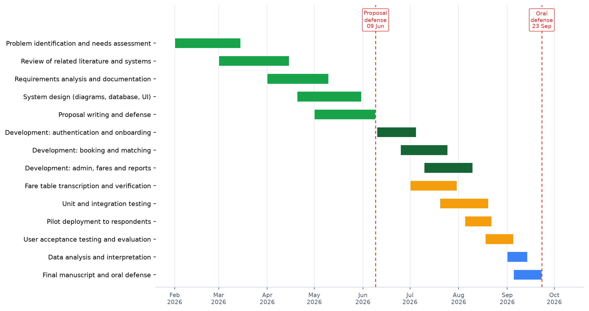{width=6.0in}

[[PB]]

## Appendix P — Researchers' Biodata

### CURRICULUM VITAE

**ALBER JUNE M. MUMAR**

Purok 6, Poblacion, Talibon, Bohol

6325 Philippines

Cellphone Number: 0962 938 4692

Email Address: alberjunemumar@gmail.com

**Personal Data**

| | |
|:---|:---|
| Age | 21 |
| Birthdate | June 20, 2004 |
| Civil Status | Single |
| Religion | Roman Catholic |
| Father's Name | Robert P. Mumar |
| Mother's Name | Alma M. Mumar |

**Educational Attainment**

| | |
|:---|:---|
| Secondary | San Jose National High School, San Jose, Talibon, Bohol |
| Elementary | Talibon I Central Elementary School, Poblacion, Talibon, Bohol |

[[PB]]

### CURRICULUM VITAE

**JULEBETH HINLAYAGAN**

Purok 5, Mabuhay Cabiguhan, Trinidad, Bohol

6325 Philippines

Cellphone Number: 0977 725 7182

Email Address: hinlayaganbeth@gmail.com

**Personal Data**

| | |
|:---|:---|
| Age | 24 |
| Birthdate | July 24, 2001 |
| Civil Status | Single |
| Religion | Roman Catholic |
| Father's Name | Policronio Rosales Sr. |
| Mother's Name | Marissa F. Hinlayagan |

**Educational Attainment**

| | |
|:---|:---|
| Secondary | Calinan National High School, Calinan, Poblacion, Davao City |
| Elementary | Lpt. Cipriano Senior Elementary School, Calinan, Poblacion, Davao City |

[[PB]]

### CURRICULUM VITAE

**MARDY GONZAGA**

San Carlos, Talibon, Bohol

6325 Philippines

Cellphone Number: 0946 240 7802

Email Address: mardygonzaga@gmail.com

**Personal Data**

| | |
|:---|:---|
| Age | 24 |
| Birthdate | December 3, 2002 |
| Civil Status | Single |
| Religion | Roman Catholic |
| Father's Name | Teddy Gonzaga |
| Mother's Name | Marlyn Gonzaga |

**Educational Attainment**

| | |
|:---|:---|
| Secondary | San Jose National High School, San Jose, Talibon, Bohol |
| Elementary | Garcia Park Elementary School, San Carlos, Talibon, Bohol |
